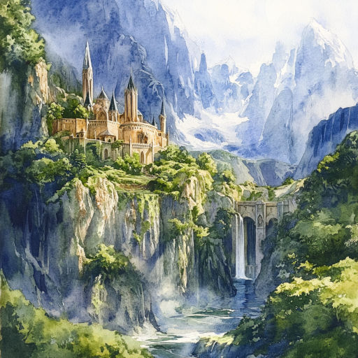

# Властелин Колец и все-все-все { #lord-of-the-the-rings }

Книжный мир полон современной литературы на любой вкус и цвет. И в таком многообразии найти хорошую историю по душе бывает очень трудно. Я лично люблю книги прошлых лет, особенно "Властелин Колец".

На первый взгляд история о забавных хоббитах, прекрасных эльфах, великих воинах и Кольце может показаться просто захватывающей детской сказкой. Но создатель легендариума Джон Рональд Руэл Толкин вложил в него много философских мыслей.<!-- more -->

Во-первых, в центре произведения извечная тема -- противостояние добра и зла. Хоббиту Фродо Бэггинсу достаётся от его дяди волшебное Кольцо. Но оказывается, это Кольцо Всевластия, которое нужно Тёмному Властелину Саурону, чтобы захватить мир. Фродо приходится отправляться в опаснейший путь. Но Джон Толкин не просто поучает: добро сильнее зла. Он доказывает, что даже слабый и простой может спасти мир.

Во-вторых, важную роль играет союзничество. В трилогии первая часть "Братство Кольца" названа по имени объединения девяти разных персонажей. Цель Братства -- дойти до Мордора, страны, где обитает Саурон, и уничтожить Кольцо в огне вулкана. Между членами Братства Кольца порой возникают разногласия и недомолвки. Несмотря на то, что Братство распадается в конце первой части, они становятся настоящими союзниками и друзьями.

В-третьих, на пути героев много соблазнов. Кольцо -- воплощение зла, оно повинуется только Тёмному Властелину. Поэтому оно подчиняет себе волю всякого, кто им "владеет". Много раз Фродо едва не поддавался силе Кольца. Даже могучий воин Боромир, один из Братства, был сломлен. Этим Толкин показывает, что такое сила духа.

В-четвёртых, в этой книге есть настоящая дружба. Садовник Сэм, слуга главного героя, идёт вместе с ним до конца. Не потому, что это его хозяин. Они друзья. Там где не справляется Фродо, помогает Сэм. Наверно, без него Фродо не справился бы со своей миссией. То есть дело зачастую вовсе не в положении -- кто "выше", кто "ниже".

Что ещё могу добавить?

* Сам Джон Толкин был профессором филологии. Поэтому, если копать глубже, в именах персонажей "Властелина Колец" можно найти много интересных отсылок к мифологии и языковым особенностям народов Скандинавии.

* В книге часто встречаются песни, стихи и отрывки сказаний. Этим Толкин погружает читателя глубже в мир Средиземья.

* По сути, повествование -- это история большого путешествия. А следить за путешествиями всегда интересно.

Почему не фильм? Ведь режиссёр Питер Джексон в начале XXI века снял впечатляющую экранизацию этой трилогии, собравшую множество наград, премий и номинаций... На мой взгляд, фильм и книга -- совершенно разные вещи. Не потому, что фильмы мне чем-то не угодили. Просто это сами по себе разные жанры. К тому же, экранное время "съедает" множество интересных вещей из оригинала. Сценаристы убирают некоторых героев или целые сцены, которые стоят внимания. Даже расширенные, "режиссёрские" версии не дают той картины, которую даст книга.

Конечно, и книга, и фильм довольно длинные. Но в ста страницах и часе экранного времени не уместить историю, которая стала основоположником современного фэнтези.

Так что мой совет -- почитайте "Властелина Колец", а потом посмотрите фильм. Так и картина будет полная, и вы точно не пожалеете о потраченном времени. Приятного чтения и просмотра!

