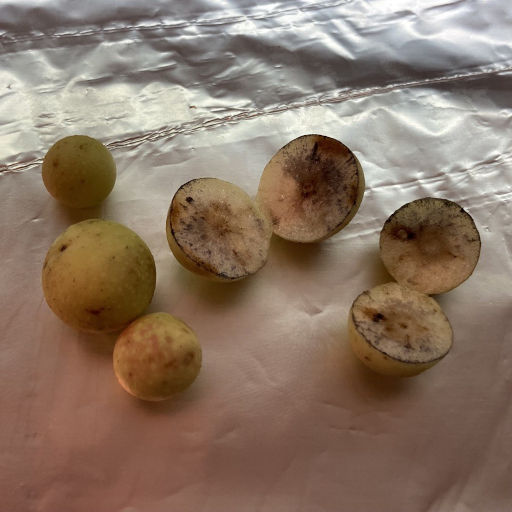
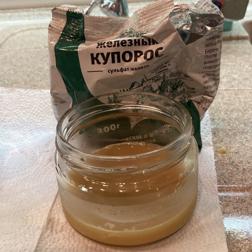
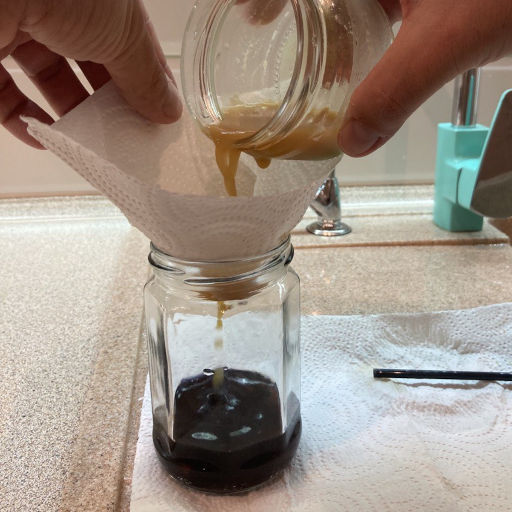

# Яблочки с дуба { #oak-apples }

Однажды, гуляя осенью по парку, я заметила на обратной стороне дубовых листьев странные наросты, похожие на маленькие яблочки. Что же это такое?
<!-- more -->

Из энциклопедии я узнала, что это дубовые галлы -- "домики" для растущих личинок насекомого дубовой орехотворки. Орехотворки, откладывая на листьях дуба яйца, наносят вред деревьям. Ведь растущие насекомые забирают из листьев вещества, необходимые для дуба. Но есть от галлов и польза!

В стародавние времена, ещё до изобретения книгопечатания, все книги, письма, листки новостей писались чернилами от руки. Для производства чернил использовались самые разные материалы, и один из них – дубовые галлы или как их ещё называют – чернильные орешки.

## История чернил из дубовых галлов

Чернильные орешки были известны и использовались в производстве чернил по крайней мере со времён Римской Империи. Долгое время, начиная со Средних веков, эти чернила часто применялись в письме; наиболее распространены они были начиная с восемнадцатого века вплоть до середины двадцатого века в связи с постепенным увеличением грамотности. Для изготовления железистых чернил галлы настаивали и добавляли железные опилки. Процесс длился до месяца. Для того, чтобы чернила "лучше ложились" на бумагу, в них добавляли вишнёвую смолу – камедь. Получаемые таким образом чернила почти не выцветали и были водостойкими. Но, из-за наличия в составе активных веществ, они вызывали разрушение бумаги. На Руси переписчики рукописей также использовали "чернять дубом с железинью" -- "железные" чернила, которые готовили из железного купороса путём добавления в него отвара из чернильных орешков с дубовых листьев.
{ #continue }

## Рецепт железистых чернил

Я сделала чернила из галлов в домашних условиях -- их можете приготовить и вы!
Для приготовления чернил мне понадобились:

1. Дубовые галлы -- 40 штук.
2. Вода -- 100 мл.
3. Железный купорос (продаётся в магазине для садоводов) -- 1 ст. л.
4. Пищевой загуститель гуаровая камедь (продаётся в продуктовом магазине) -- на кончике ножа.

Я отделила собранные галлы от листьев, промыла их. Подстелила фольгу, чтобы не испачкать рабочую поверхность. С помощью канцелярского ножа я разрезала каждый галл пополам.

Я заметила, что при контакте галлов с железным ножом начали образовываться чернила -- металл ножа почернел.

Это явление использовали ещё в древности. В Древнем Риме недобросовестные продавцы разбавляли медный купорос более дешёвым железным купоросом. Для того, чтобы обнаружить подделку, использовали чернильные орешки: чёрная окраска выдавала наличие железа в купоросе.

Нарезанные галлы я положила в воду и прокипятила на водяной бане.

Настоявшийся несколько дней отвар я процедила через фильтр -- бумажное полотенце, свёрнутое воронкой.

Затем я приготовила раствор железного купороса. Для этого я растворила одну столовую ложку купороса  в воде и размешала.

Этот раствор я тоже процедила через бумажный фильтр и добавила в отвар из дубовых галлов. При смешивании, отвар мгновенно окрасился в густой чёрный цвет.

В готовую смесь я добавила на кончике ножа загуститель -- гуаровую камедь.

Раньше для письма использовались птичьи перья. А сейчас мне, чтобы писать приготовленными чернилами, понадобилась специальная перьевая ручка, которую можно купить в магазине канцтоваров. Она представляет собой рукоятку и набор сменных металлических наконечников. Используя разные наконечники, можно проводить линии разной толщины.

Я пробовала писать приготовленными чернилами до добавления загустителя. Но чернила были слишком жидкими и приходилось часто обмакивать ручку. После добавления камеди, одного обмакивания стало хватать, чтобы написать короткую фразу.

Попробуйте сами сделать чернила -- это очень интересно!

