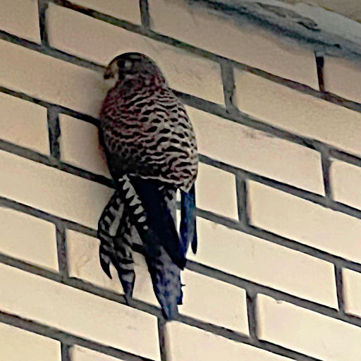

# Сосед сверху  { #upstairs-neighbor }

Я живу в городе Тула. Город мой называют Оружейная столица, Самоварная столица, Пряничный край, Мастерская России. Но больше всего на моей родине заводов и предприятий чёрной металлургии. И как следствие -- загрязнённость окружающей среды. Но я люблю свой город.

Я живу на последнем этаже многоэтажного высотного дома. В окошке квартиры в сумерках можно увидеть зарево, два или три солнца. Это на металлургических заводах льют расплавленный металл. Страдает экология! И на первый взгляд кажется, что в городе кроме привычных всем собак и кошек да голубей с воробьями не встретишь никакой фауны. Но это только так кажется.
<!-- more -->

Как-то зимой в оттепель стала протекать крыша нашей лоджии. Папа вместе с работниками управляющей компании полез разбираться в чём дело. Каково же было всеобщее удивление, когда причиной был засор водосточного жёлоба. Всё было в птичьих перьях. Засор прочистили, а мы стали пристально наблюдать в окошки.
{ #continue }

Несколько раз, пока ещё не рассвело на улице, мельком нам удавалось увидеть птицу, которая скрывалась в нише-крыше нашей лоджии. Через несколько минут вниз полетели перья, как будто кто-то тряс перьевую подушку. Стало ясно -- над нами поселилась хищная птица. Но какая?

Прошлой зимой пошёл сильный ледяной дождь. Такая мерзкая погода, когда на улице минус, а с неба идёт дождь. На земле он покрывает всё ледяной коркой. В этот день нам удалось увидеть и сфотографировать птицу, прячущуюся от непогоды.

Сами определить вид птицы мы не смогли. Тогда было принято решение обратиться к специалистам местного краеведческого музея. Там-то нам сказали, что у нас поселился сапсан.

Сапсан относится к семейству соколиных. Это самая быстрая птица, в стремительном пикирующем полёте она способна развивать скорость свыше 320 км/ч. Охотится на небольших птиц -- голубей, галок. Гнездится на скалистых обрывах, вершинах, реже на кочках моховых болот или каменных строениях -- крышах и уступах высотных зданий, колокольнях.

Сапсаны летят к местам зимовки на расстояние от 2 до 11 тысяч километров, преодолевая до 1200 километров за сутки. Из года в год сапсаны летают одними и теми же маршрутами и не меняют места гнездования и зимовки.

А самое удивительное, что сапсан занесён в Красную книгу. С нами связались учёные, которые занимаются переизданием Красной книги Тульской области. Их очень интересовало: не находили ли мы гнездо этой птицы? Ведь на территории Тульской области пока не обнаруживали мест, где гнездился сапсан.

Не нашли и мы гнезда. Но, возможно, наш сосед сверху ещё маленький.
Продолжительность жизни птицы -- примерно 17 лет, а мы за ним наблюдаем пару зим. Ещё не одну зиму будет он к нам прилетать.

Сидишь вечером у окна, наблюдаешь за тысячей машин и заревом от заводов. А наш сосед сверху -- краснокнижная птица! Какая же природа удивительная!

