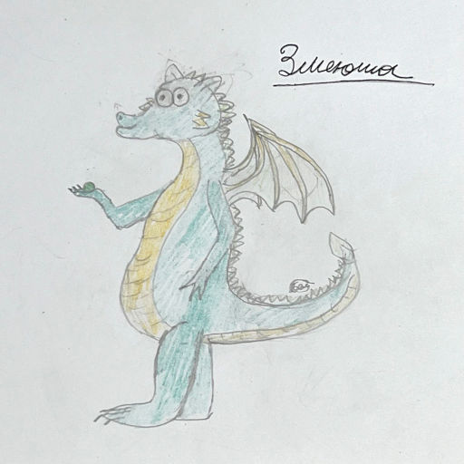

# Горыныч и петанк

> Сказка

В самой обычной волшебной стране, на окраине самого обычного волшебного городка, на самом обычном холме, в самом обычном замке жил самый обычный дракон. Он бы так и жил там своей обычной драконьей жизнью, если бы в один день не произошло нечто необычное.

То утро начиналось беспокойно. Дракон как угорелый носился по всему своему замку, подставляя вёдра под потоки воды, льющейся с прохудившейся крыши. С грохотом он распахнул дверь и вломился в библиотеку.

-- Что же за наказание!? -- сетовал дракон, подставляя под струю дождевой воды чашечку из фамильного набора. -- Даже вёдра все кончились, что же это за наказание...

Устав, он плюхнулся прямо в лужу. Но тут же вскочил. Книги лежали прямо в воде. Сам дракон читал последний раз триста лет тому назад, но библиотеку сохранял бережно, каждая книжка была у него на счету. И увидев свои сокровища в лужах, он кинулся расставлять их по полочкам. Попутно он своим длинным хвостом сметал книжные стеллажи, всё падало, грохало, лужи всплёскивали, дракон снова всё поднимал и ронял... Грохот стоял невообразимый и неизвестно, сколько бы всё это продолжалось, как вдруг его внимание привлёк конверт, как маленький плот качавшийся на поверхности лужи.

Взяв конверт, дракон принялся вертеть его в лапах. Хоть он и читал мало, но свой фамильный герб знал отлично и сразу заметил его на печати. Раскрыв конверт, дракон достал желтоватую бумажку. Развернув, стал читать:

"Дорогой Змеюша!"

-- Змеюша... -- дракон поморщился. -- Змей, Змеенька... -- он жутко не любил своё собственное имя и злился, когда к нему обращались "Змей". Но в паспорте так написано, ничего не поделаешь...

"Не знаю, найдёшь ли ты это письмо. Его написал твой папа, Горын, то есть я"

Дракон вытаращился на эту фразу. Его называли Горынычем, но он никогда не 
задумывался о том, что это отчество!

"Когда ты был совсем ещё маленьким, я уехал в долгую командировку на тысячу лет"

Змеюша присвистнул: -- Тысяча лет... -- даже по драконьим меркам это долго.

"В этом конверте ты найдёшь мой подарок. Используй его для процветания боулспорта в нашем городке!"

Горыныч ещё раз пробежался глазами по письму. Непонятности, да и только. Дракон потряс конверт и из него ему в лапу упал маленький шарик. Лёгонький, из дерева, шарик был окрашен зелёной краской, облупившейся от времени. Покидав его, Горыныч зачем-то 
понюхал шарик, но учуял лишь слабый-слабый застаревший запах краски.

--- Я это так не оставлю! -- заявил дракон в пустоту.

Сжав шарик в лапе и прихватив письмо, он решительно развернулся. Фамильная чашечка не устояла, покатилась по полу и разбилась.

-- На счастье! -- добавил дракон и вышел из библиотеки.

Непривычно быстрым шагом он спустился по лестнице на свой подземный паркинг. Пахнуло сыростью, под лапами что-то захлюпало и зачавкало. В уголочке, весь заросший паутиной, стоял мотоцикл с коляской. Но самое главное, отличающее этот мотоцикл от всех 
остальных -- крылья. Бережно смахнув с них пыль, дракон оборвал клочья паутины. Окинув мотоцикл умильным взглядом, он чуть не прослезился, словно встретил старого друга. Змеюша нацепил ветхий шлем, висевший на руле.

-- В фильмах вроде это делается под крутую музыку, -- проговорил дракон. -- Туц, туц-туц туц! -- он снял с крючка кожаную куртку и эффектно запахнулся. Потом сунул шарик и письмо во внутренний карман. С кряхтением поднял тяжеленные ворота и плюхнулся на 
мотоцикл. Тот зашатался под его внушительным весом, но выстоял. -- Ну-с, погнали.

В мотоцикле что-то зашуршало, затарахтело и он, покашливая, тронулся. Выкатив с паркинга, остановился на обрыве. Ворота за спиной Змеюши заворчали и с грохотом закрылись.

-- Как в старые добрые времена! -- ностальгически вздохнув, дракон дал газу.

Мотоцикл заревел, как дикий зверь, выпущенный на свободу и рванул с обрыва. Крылья расправились ветром и мотоцикл взмыл в утреннее небо навстречу солнцу.

А через полчаса Змеюша уже был в местной городской библиотеке и нетерпеливо барабанил когтями по стойке. Библиотекарь, низенькая девушка, ошарашенно смотрела на дракона.

-- Как, как, Вы ска-каза-ли? -- заикалась она своим высоким, почти девчачьим голоском.

-- Я сказал, выпишите на мой формуляр всё о боулспорте, -- повторил дракон. -- У меня в 
замке такого нет, у вас точно есть.

-- Н-нет... Н-нету... -- бормотала библиотекарь.

-- Ладно, спасибо, --  он развернулся.

-- Может вам подойдёт сборник произведений Александра Пушкина? -- робко сказала девушка ему вдогонку.

-- Нет, спасибо.

Прогрохотав по лестнице, Змеюша заколотил по большой двери с серьёзной табличкой "Тихо! Не беспокоить! Идёт выдумка поэмы!" Дверь почти тут же отворилась. На пороге стоял чёрный в белом фраке кот, такой же серьёзный, как и табличка. На шее галстук, на 
лапах белые сапожки.

-- Чего шумите? -- осведомился кот, поправляя сползшие круглые очки.

Дракон набрал в лёгкие побольше воздуха и выдал гневную тираду. Потом он сам удивлялся, как это он с ходу выпалил столько всего грозного:

-- Как так?! Центральная библиотека, главная, а про боулспорт нет! И Пушкин есть, и Лермонтов есть, всё на свете есть, только не про боулспорт!!!

-- Тихо, тихо, не шумите, -- у кота шерсть встала дыбом.

-- Да какое "не шумите", ты что, Кот, своих не узнаёшь? Дракон пришёл, единственный в 
городе, а тут такой непорядок!

Что бы ещё наговорил Змеюша, остаётся лишь гадать. К счастью, кот по имени Кот вовремя предложил выпить чаю с бутербродами и всё обсудить в мирной обстановке. Дракон мигом утихомирился и зашёл за Котом в его каморку.

Внутри было пыльно, но к своему удовлетворению Змеюша про себя отметил, что не так, как у него на паркинге. Всё было завалено исписанными и исчёрканными листками бумаги, они громоздились везде, даже на кровати. Расчистив стул для гостя и разлив чай, заваренный ещё на прошлой неделе, Кот выжидательно уставился на дракона. Змеюша махом выпил ледяной чай, прожевал бутерброд и рассказал, как было дело: про дождь, про письмо и про шарик.

-- Шарик? -- заинтересовался Кот. -- Можно глянуть?

-- Да ничего такого, Учёный, -- дракон выудил из своей куртки шарик и отдал Коту. -- Что такое боулспорт этот ваш, а?

Учёный будто и не слышал его. Рассматривая шарик и так и сяк, он наконец выдал:

-- Это же кошонет!

-- Какой корнишон? -- охнул Змеюша. -- Ты тут со своими поэмами совсем того, что ли?

-- Не корнишон, а кошонет! -- назидательно поправил его Кот. -- Шарик для игры в петанк!
Дракон чуть не заплакал:

-- Да что это такое, боулспорт, петанк, кошонет?..

-- М-да. Понятно, что тебе ничего не понятно. -- Кот выудил откуда-то чемоданчик и спросил. -- Разобраться хочешь?

-- Мечтаю! -- искренне выпалил Змеюша.

-- Тогда пошли в парк.

Они вышли из библиотеки. Дракон уселся за руль, Кот -- в коляску. И уже скоро они высадились перед центральным парком. Неподалёку от одной из аллеек раскинулась ровная зелёная полянка. Учёный Кот выделил участок холщовой верёвкой, которая лежала у него в кармане, затем распаковал чемодан. Внутри оказались три золотых и три серебряных шарика.

-- Три тебе, три мне, -- Кот отдал Змеюше золотые, себе взял серебряные. -- Твой отец был великим боулспортсменом. Он всегда хотел, чтобы как можно больше людей, и не только, узнало о петанке. Но это так, к слову. Перейдём к правилам.

И Учёный подробно объяснял дракону, что надо сперва разыграть, затем поставить кошонет, потом кидать... Змеюша сразу втянулся и оказался весьма метким соперником. Они с Котом сыграли уже до тринадцати очков и собирались сыграть ещё разок, как вдруг их 
окликнул бодрый голос:

-- А вы что делаете-то, касатики?

-- О, Яга пришла! -- обрадовался Кот. -- Мы в петанк играем с Горынычем. Присоединяйся, бабуль!

-- Я вам не бабуля! -- возмутилась Яга, но тут же остыла и заинтересованно осведомилась. -- А что такое петанк?

-- Петанк? -- к ним подскочила стройная девушка с крашенными в болотный цвет волосами, Кикимора. -- Что это?

И буквально через десять минут Кот размотал всю свою верёвку, сбегал в библиотеку за ещё несколькими комплектами шаров и вся поляна была запружена сказочными существами, играющими в петанк. Вечерело и пришлось расходиться по домам. Но на следующий день 
была ещё одна тренировка и было ещё больше народу. Потом ещё и ещё... А даже как-то раз один маленький Лешёнок не захотел уходить с корта и вместе со своим другом тайно ото всех остался и они всю ночь играли Змеюшиным кошонетом. Под утро их 
нашли. Боулспортсмены уснули прямо на дорожке среди незаконченной партии. Было ещё множество весёлых случаев.

Так пролетели две недели. В один день все снова собрались, чтобы посоревноваться. Игра была в самом разгаре, как внезапно появился тот, кого никто совершенно не ожидал увидеть. Заметив его вдали на аллее, Змеюша судорожно сглотнул, а Кот сразу покрылся испариной и промокнул лоб шёлковым платочком. К их корту приближался мэр города — Кощей Кощеевич Бессмертнов.

-- Что это такое? -- повелительно вопросил он, остановившись у корта. Все обернулись и встали, как вкопанные. Никто не проронил ни слова. -- Что это такое, я спрашиваю? -- говорил Бессмертнов спокойно, но в его глазах виднелась отчётливая злость.

-- Петанк, -- тихонечко ответил Лешёнок и тут же замолчал.

-- А разрешение на эксплуатацию земельного участка на территории особо охраняемого природного объекта с высоким статусом имеете? -- мэр бурил их суровым взором. Боулспортсмены опустили головы, никто не решался глянуть Кощею в глаза.

-- Конфисковать, -- выдал аргумент Бессмертнов. Он щёлкнул пальцами и корт растворился в воздухе. -- Хорошего всем дня, -- мэр развернулся и ушёл.

Разошлись и раздосадованные боулспортсмены. Остались только дракон с Котом. Змеюша поднял отцовский кошонет — единственное, что осталось от корта.

-- Ничего не получилось, -- вздохнул Кот. -- Ничего... Был бы март, я бы заорал на весь парк истошным голосом, а так не могу — авторитет писателя и поэта не позволяет.

-- Поехали ко мне в замок. Там можно орать, сколько душе угодно, -- мрачно предложил Змеюша.

-- Нет, орать не надо, -- покачал головой Кот. -- Но к тебе поехать можно. Ты на равнине живёшь?

-- На холме, -- бросил дракон. -- Но вершина ровная.

-- С травкой? -- не отставал Учёный.

-- Ну с травкой, а... -- Змеюша не договорил. Раскрыв пасть, он повернулся к Коту и затряс его так, что тот чуть не упал. -- Ты гений, Учёный!!! Ты гений!!! Откроем новый корт! -- дракон отпустил его и от радости аж заплясал, напевая себе под нос какую-то популярную мелодию.

Кот пришёл в себя и они со Змеюшей поспешили к выходу из парка и на летающем мотоцикле вернулись в замок. У дракона на паркинге обнаружились бордюры, взявшиеся неведомо откуда. Ими оградили каждую дорожку. Порывшись в кладовках, нашли и старый-престарый набор шаров. Но какой большой! Их натёрли до блеска и приспособили для игры. Созвали всех бывших боулспортсменов и тренировки возобновились через два дня после запрета корта в парке. Все играли и радовались, а Змеюша ликовал больше всех.

Но во время одной из игры обнаружилась пропажа старенького кошонета. Дракон запаниковал, бегал по всем дорожкам, но везде кошонеты были новые. Змеюшу пытались успокоить, но всё напрасно.

-- Это не вы потеряли? -- раздался голос.

Боулспортсмены вытаращились на Бессмертнова, будто увидели в первый раз. В открытой ладони Кощея лежал пропавший кошонет.

-- Нашёл на склоне холма, -- мэр отдал кошонет ошарашенному Горынычу. -- И, к слову... Разрешите присоединиться?

Все просто остолбенели. Но дракон не растерялся:

-- У нас и дорожка свободная есть! Проходите, Кощей Кощеевич!

-- Для друзей просто Коща, -- подмигнул мэр.

Игра возобновилась. Лешёнок рассказывал Кощею правила, все улыбались и увлечённо играли. А Змеюша вдруг подумал:

"Боулспорт объединяет!"

*05.03.2023 г.*

Рисунок автора
