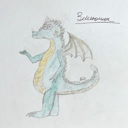
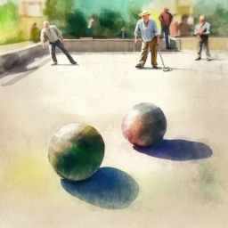
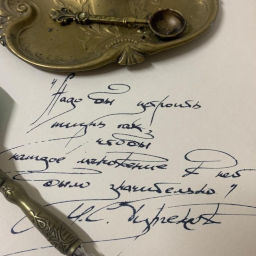

# Боулспорт

В этом разделе собраны мои произведения о боулспорте. Я писала эти произведения на основе собственного опыта игры в петанк. Приятного чтения!

??? note "Что такое боулспорт?"
    Боулспорт включает в себя разные игры в шары: самая популярная -- это пета́нк. В петанке игроки двух команд на площадке размером 15 на 4 м по очереди бросают металлические шары, стараясь как можно ближе поставить свой шар рядом с маленьким деревянным шариком -- кошонетом. При этом металлический шар может задеть кошонет, или сбить шар соперника. Главное, чтобы в конце игры один или несколько шаров оказались ближе к кошонету, чем шары соперника. За каждый такой шар начисляется одно очко. Игра продолжается до 13 очков.

    Правила игры в петанк в чём-то имеют сходство с кёрлингом, однако присутствуют также черты боулинга и бильярда. Игры, похожие на боулспорт, существовали по всему миру. Обычно использовали круглые камни или бросали окованные железом деревянные шары на точность попадания.

## Гимн российского боулспорта

С этим гимном я выиграла поэтический конкурс "Гимн/Марш боулспорта". Всероссийская федерация боулспорта напечатала мой гимн в брошюрах с правилами игр тиражом несколько сотен экземпляров. К моим стихам была написана музыка. Исполнение гимна солистами Тульской областной филармонии слушайте и смотрите на видео.

[:octicons-book-16: Читать](anthem.md){ .md-button }
[:fontawesome-brands-youtube: Смотреть](https://youtu.be/Wo4Lbd6_pWI?si=qfR-QdKHwJ9MTZq_){ .md-button }

---

## Горыныч и петанк

В один дождливый день Змеюша бегал по всему своему замку, подставляя вёдра под потоки воды с прохудившейся крыши. Но он уж точно не ожидал, что это может закончиться таинственным письмом и знакомством с такой игрой, как петанк.

[:octicons-book-16: Читать](Gorynysh-and-petank.md){ .md-button }

---

## 38 попугаев

Каждый чемпионат по боулспорту -- это целое приключение! Этот рассказ повествует о моем участии в соревнованиях "Снежный шар", организованных Тульской федерацией боулспорта.

[:octicons-book-16: Читать](38-parrots.md){ .md-button }

---

## Петанк

Петанк (с французского  дословно означает "ноги вместе") -- это провансальский национальный вид спорта, бросание шаров. О нём и рассказывается в этом стихе.

[:octicons-book-16: Читать](petank.md){ .md-button }

---

## Читайте также

<a href="../stories">
<figure>
<figcaption>Рассказы</figcaption>
</figure></a>

<a href="../tales">
<figure>
<figcaption>Сказки</figcaption>
</figure></a>

<a href="../poems">
<figure>
<figcaption>Стихи</figcaption>
</figure></a>

<a href="../fanfics">
<figure>
<figcaption>Фанфики</figcaption>
</figure></a>

<a href="../riddles">
<figure>
<figcaption>Загадки</figcaption>
</figure></a>

<a href="../blog">
<figure>
<figcaption>Блог</figcaption>
</figure></a>

