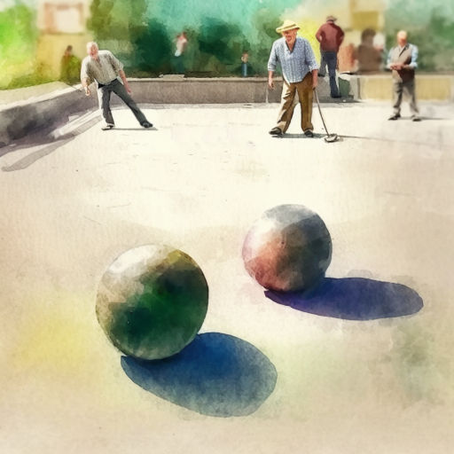
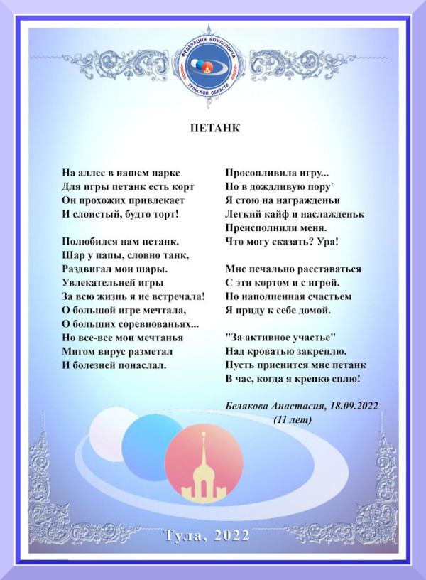

# Петанк

На алее в нашем парке  
Для игры петанк[^1] есть корт.  
Он прохожих привлекает  
И слоистый, будто торт!

Полюбился нам петанк.  
Шар у папы, словно танк,  
Раздвигал мои шары.  
Увлекательней игры  
За всю жизнь я не встречала!  
О большой игре мечтала,  
О больших соревнованьях...  
Но все-все мои мечтанья  
Мигом вирус разметал  
И болезней понаслал.

Просопливила игру...  
Но в дождливую пору  
Я стою на награжденьи.  
Лёгкий кайф и наслажденье  
Преисполнили меня.  
Что могу сказать? Ура!

Мне печально расставаться  
С этим кортом и с игрой,  
Но наполненная счастьем  
Я приду к себе домой.  
"За активное участье"  
Над кроватью закреплю.  
Пусть приснится мне петанк  
В час, когда я крепко сплю!

*18.09.2022 г., автору 11 лет.*

[^1]: Петанк -- игра в шары, придуманная во Франции. Название переводится как "ноги вместе".

***

