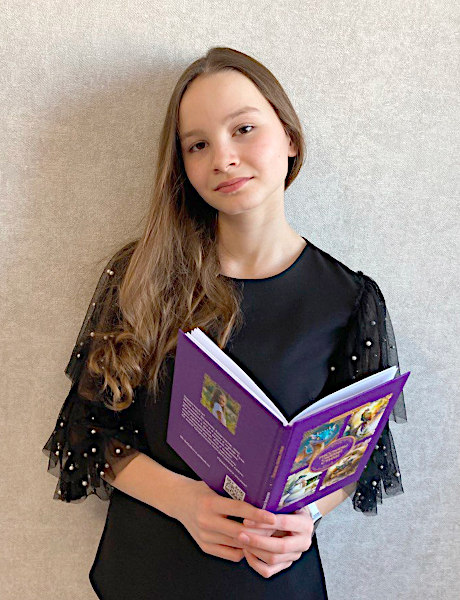

# Об авторе

Здравствуйте! Меня зовут Белякова Анастасия. Мне одиннадцать лет, я живу в городе [Тула](https://ru.wikipedia.org/wiki/%D0%A2%D1%83%D0%BB%D0%B0), и моё хобби -- сочинять сказки, стихи, рассказы и загадки.

<a href="stories">
<figure>
<figcaption>Рассказы</figcaption>
</figure></a>

<a href="tales">
<figure>
<figcaption>Сказки</figcaption>
</figure></a>

<a href="poems">
<figure>
<figcaption>Стихи</figcaption>
</figure></a>

<a href="fanfics">
<figure>
<figcaption>Фанфики</figcaption>
</figure></a>

<a href="riddles">
<figure>
<figcaption>Загадки</figcaption>
</figure></a>

На этом сайте вы можете ознакомиться с моим творчеством. Я стараюсь каждую неделю обновлять сайт, все новинки вы сможете увидеть в разделе [Новости](news.md). Чтобы не пропускать новости, подпишитесь на [канал сайта в Telegram :fontawesome-brands-telegram:](https://t.me/lib_beliakova) или [страницу ВКонтакте :fontawesome-brands-vk:](https://vk.com/lib_beliakova).

Моя электронная почта для обратной связи: lib-beliakova@mail.ru.

