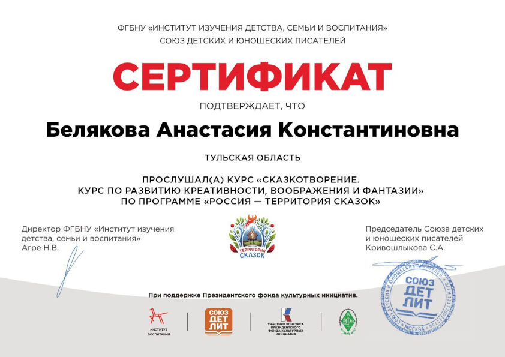

# Новости

!!! info "Новости в Telegram и VK"
    Чтобы не пропускать новости, подпишитесь на [канал сайта в Telegram :fontawesome-brands-telegram:](https://t.me/lib_beliakova) или [страницу ВКонтакте :fontawesome-brands-vk:](https://vk.com/lib_beliakova).

## 31.07.2023: Стихотворение "Старый дворец"

Лето -- прекрасная пора для путешествий. В давнюю пору было построено множество дворцов, которые теперь стали музеями. Я посетила один из таких музеев и в своём новом стихотворении [Старый дворец](poems/old-palace.md) описала свои эмоции от этой экскурсии.

## 15.07.2023: Рассказ "Как Петя заварил кашу"

Этот рассказ -- один из первых, опубликованных на моём сайте. Полгода назад я участвовала в конкурсе "Ох уж эти дети", который проводило издательство "Мелик-Пашаев". Специально для конкурса я переписала этот рассказ, чтобы он подходил для детей дошкольного возраста: сократила объём и поменяла некоторые сюжетные детали. Теперь я публикую на сайте [новую версию рассказа](stories/petya.md).

## 06.07.2023: Стихотворение "Ромашка"

Длинные библиотечные стеллажи могут скрывать в себе много тайн и историй. Причём не только книжных, но и настоящих. В своём новом стихотворении [Ромашка](poems/chamomile.md) я написала об одной неожиданной находке меж страниц старой книги.

## 29.06.2023: Детский литературный интернет-журнал "Мавочки и Дельчики"

В мае 2023 года меня приняли в постоянные авторы детского литературного интернет-журнала "Мавочки и Дельчики". Мой первый рассказ, опубликованный в 186-м номере этого журнала -- [Лето, в которое случилось это](stories/summer.md).

Бесплатный благотворительный журнал "Мавочки и Дельчики" выходит с 2007 года и распространяется по подписке. В нём на безвозмездной основе публикуются детские писатели и поэты. Основные читатели журнала  -- воспитанники детских домов. В России там воспитываются около 400 тысяч детей.

Если вы знаете контакты детских домов, приютов, школ-интернатов и прочих учреждений для неимущих детей, инвалидов и сирот, которые могли бы стать подписчиками журнала "Мавочки и Дельчики", пришлите их на мою электронную почту lib-beliakova@mail.ru.

## 23.06.2023: Стихотворение "Лето"

Читайте новое пейзажное стихотворение [Лето](poems/summer.md).

## 16.06.2023: Стихотворение "После грозы"

Я стараюсь постоянно совершенствовать свои писательские навыки, поэтому время от времени перечитываю и дорабатываю старые произведения. Сейчас лето -- пора гроз, и я решила обновить свой стих [После грозы](poems/after-storm.md).

## 08.06.2023: Очерк "Ясная Поляна"

Многие знают деревню Ясная Поляна, ведь в ней расположена усадьба великого писателя Льва Николаевича Толстого. Обычно туристы, приезжающие сюда, видят башни въезда, дом писателя, посещают могилу Льва Николаевича. И на этом знакомство с Ясной Поляной у большинства заканчивается. Но я хотела вам рассказать о немного другой Ясной Поляне... Из моего [очерка "Ясная Поляна"](stories/Yasnaya-Polyana.md) вы узнаете о многих интересных и красивых местах неподалёку от знаменитой усадьбы. Вы можете использовать маршруты, описанные в нём, и посетить все эти места. В конце очерка я оставила ссылки на маршруты в Яндекс.Картах.

## 30.05.2023: Стихотворение "Коты-проказники"

Какой кот не любит пошалить? Все их проказы просто невозможно перечислить. Но я попыталась. В моём новом стихе [Коты-проказники](poems/cats.md) рассказывается о кошачьих шалостях, привычных и неожиданных.

## 29.05.2023: Книжный фестиваль "Красная площадь"

Крупнейший [литературный фестиваль](https://bookfestival.ru/) приглашает книголюбов на Красную площадь в Москве. Фестиваль пройдёт со 2 по 6 июня. Около 400 издательств со всей России представят на нём свои лучшие книги и новинки. В шатре №17 (регионы России) на стенде издательства "Свамия" вы можете приобрести мою книгу ["Рассказы, сказки, стихи"](https://vk.com/video796459389_456239017).

## 18.05.2023: Стихотворение "Легенда о Зелёной палочке"

Я написала [стихотворение "Легенда о Зелёной палочке"](poems/green-stick-legend.md), когда проходила курс "Мы -- начинающие поэты" под руководством детского поэта Оксаны Рахмановой. Сюжет стихотворения основан на легенде о [зеленой палочке](https://ru.wikipedia.org/wiki/%D0%97%D0%B5%D0%BB%D1%91%D0%BD%D0%B0%D1%8F_%D0%BF%D0%B0%D0%BB%D0%BE%D1%87%D0%BA%D0%B0), которую рассказал Л. Н. Толстому его старший брат.

## 11.05.2023: Моя заметка в газете "Восьмое измерение"

Я попробовала себя в роли корреспондента и написала для школьной газеты "Восьмое измерение" заметку про свою первую учительницу. Мою статью разместили на первой странице.

??? note "Заметка и диплом"
    

    

    

## 10.05.2023: Литературные курсы

Я прослушала курсы лекций, организованных "Союзом детских и юношеских писателей".

* Курс **"Литературные курсы блогеров"** провела детская писательница Наталья Спехова-Роси.
* Курс **"Мы -- начинающие поэты"** провела детский поэт и поэт-песенник Оксана Рахманова.
* Курс **"Сказкотворение. Курс по развитию креативности, воображения и фантазии"** провела детская писательница, председатель "Союза детских и юношеских писателей" Светлана Кривошлыкова.

??? note "Сертификаты о прохождении курсов"
    

    

    

## 02.05.2023: Произведения о боулспорте

На моём сайте появился новый раздел. Читайте [произведения о боулспорте](../boulsport).

А ещё я хотела бы поделится с вами большим событием в моей писательской жизни. Я победила в поэтическом  конкурсе "Гимн/Марш боулспорта". Мой [гимн](boulsport/anthem.md) напечатали в брошюрах с правилами боулспорта тиражом несколько сотен экземпляров.

30 апреля состоялось торжественное награждение победителей конкурса. Выражаю огромную благодарность [Всероссийской федерации боулспорта](http://boulsport.ru/) и [Федерации боулспорта Тульской области](https://boulsport-tula.ru/).

??? note "Диплом и "Гимн российского боулспорта""
    

    

## 22.04.2023: Книга за подписку!

В моём Телеграм-канале проводится [розыгрыш](https://t.me/lib_beliakova/32) моей книги "Рассказы, сказки, стихи".

## 16.04.2023: Стихотворение "О весне"

Стихотворение [О весне](poems/about-spring.md) рассказывает о приходе тёплой весны в мой город. К этому стиху я сняла видео, в котором я читаю и играю на фортепиано. Видео вы найдёте под текстом произведения.

## 11.04.2023: Рассказ "Первый на орбите"

Космос манит всех на Земле. И вот однажды необычный космонавт отправляется на орбиту. Что произойдёт на Международной космической станции? Кто спасёт её экипаж? Читайте новый фантастический рассказ, написанный ко Дню космонавтики -- [Первый на орбите](stories/first-in-orbit.md).

## 04.04.2023: Рассказ "Соня полосатая"

Вы уже знакомы с Люсей из моего рассказа "Подготовка к празднику"? Читайте свежий рассказ о новых школьных приключениях Люси после весенних каникул -- [Соня полосатая](stories/sonya.md). Жанр и тему нового произведения выбрали подписчики моего Telegram-канала.

## 31.03.2023: Писательские курсы

Я прослушала курс лекций детской писательницы Евгении Малинкиной "Творческая лаборатория". Курс организован "Союзом детских и юношеских писателей".

??? note "Сертификат"
    

## 21.03.2023: Рассказ "Пробуждение от спячки"

Под весенними лучами все согреваются и становятся добрее. О приходе тепла и пробуждении от зимнего сна говорится в моём новом произведении -- [Пробуждение от спячки](stories/awakening-from-hibernation.md).

## 14.03.2023: Стихотворение "Ослик"

Этот стих посвящается ослику Паше из конюшни центрального парка моего города. О доброте и мечтах читайте в моём новом произведении -- [Ослик](poems/donkey.md).

## 07.03.2023: Рассказ "Подарок"

Наступил март -- месяц кошечек. Кто не любит кошек? Ведь они такие мягкие, пушистые, они мурчат и приносят в дом умиротворение... А ещё они цветоводы, принцессы и просто обожают шалить! О проказах кошки Машки, жившей у моих родителей, читайте в моём новом рассказе -- [Подарок](stories/present-mashka.md). Это произведение победило в конкурсе "Тайная жизнь наших питомцев", который проводила Тульская областная детская библиотека и награждено дипломом.

??? note "Диплом Тайная жизнь наших питомцев"
    

## 22.02.2023: Издан сборник моих произведений

Напечатана моя первая книга -- "Рассказы, сказки, стихи". В неё вошли некоторые произведения с этого сайта. Тираж разлетится по детским библиотекам.

??? note "Моя книга"
    

## 15.02.2023: Писательские курсы

Я прослушала курс лекций детской писательницы Екатерины Матюшкиной "Писательское мастерство детям". Курс организован "Союзом детских и юношеских писателей".

??? note "Сертификат"
    

## 11.02.2023: Иллюстрации на сайте

Теперь у всех произведений на моём сайте есть иллюстрации. Рисунки созданы нейросетью на основе фрагментов моих произведений.

## 05.02.2023: Рассказ "Лето, в которое случилось это"

Куда бежит бабушкин петух Петька? Что в таинственной посылке? Читайте новый рассказ о летних приключениях городского мальчика Васи в деревне -- [Лето, в которое случилось это](stories/summer.md). Этот рассказ -- домашнее задание онлайн-курса "Творческая лаборатория", организованного "Союзом детских и юношеских писателей".

## 02.02.2023: Стихотворение "Стояла осень..."

Этот стих появился благодаря прочтению произведения Паустовского "Барсучий нос". Читайте новое стихотворение об осеннем утре -- [Стояла осень...](poems/it-was-autumn.md)

## 30.01.2023: Конкурс от издательства "Мелик-Пашаев"

Мой рассказ [Как Петя заварил кашу](stories/petya.md) принял участие в конкурсе от издательства "Мелик-Пашаев" и попал в лонг-лист.

## 13.01.2023: Стихотворение "Тихо трепещет заснеженный лес..."

Если кончились новогодние каникулы, то это вовсе не значит, что и чудеса кончились! Ведь они окружают нас повсюду, например, в природе. Читайте мой новый стих, посвящённый чудесам зимней природы -- [Тихо трепещет заснеженный лес...](poems/forest-is-quivering.md) Это стихотворение я написала в преддверии Старого Нового года.

## 04.01.2023: Иллюстрации к стихам

Теперь у моих [стихов](poems/index.md) появились иллюстрации.

## 29.12.2022: Благодарность

Историко-культурный и природный музей-заповедник И. С. Тургенева "Бежин луг" отметил моё стихотворение [В деревне](poems/country.md) благодарственным письмом.

??? note "Благодарность"
    

## 09.12.2022: Стихотворение "На коньках"

Начался декабрь -- последний месяц года! Все стремятся в парк, прокатиться на коньках по свежему искристому льду. Моё новое стихотворение [На коньках](poems/skating.md) -- именно о таких моментах.

## 27.11.2022: Музыкальный канал на YouTube

Теперь у меня есть [Канал на YouTube](https://www.youtube.com/@a-tunes), где буду выкладывать популярные мелодии в моём исполнении на фортепиано.

## 25.11.2022: Аудиосказки

Теперь в разделе [Сказки](tales/index.md) вы можете не только читать, но и слушать сказки, озвученные автором.

## 25.11.2022: Стихотворение "После грозы"

Когда недавно отгремела гроза и небо только-только расчистилось от туч, закат кажется просто волшебным. Такие воспоминания и легли в основу моего нового стиха -- [После грозы](poems/after-storm.md).

## 12.11.2022: Окончание рассказа "Однажды, под нашим домом..."

Как важно всегда заканчивать начатое! Наконец-то я дописала давно начатый рассказ в стиле фэнтези -- [Однажды, под нашим домом...](stories/under-our-house.md).

## 07.11.2022: Стихотворение о птицах

Близятся холода и птицам станет трудно добывать себе пищу. Но мы можем помочь, оставив им в кормушках вкусное угощение! Ведь так приятно наблюдать за тем, как маленькие птахи слетаются на корм, качаются на веточках и нетерпеливо прыгают... Такие мысли и воспоминания вдохновили меня на написание нового стиха -- [Птичий обед](poems/avian-dinner.md).

## 05.11.2022: Стихотворение о зиме

Идёт последний месяц осени! Совсем скоро подуют метели, засвистят ветра, пруды и реки засверкают, как льдистые зеркала... Моё новое стихотворение -- [Шаги зимы](poems/winter.md) -- как раз о приходе этого холодного, но по-своему прекрасного времени года.

## 05.11.2022: Результаты конкурса "Весёлый багаж"

Мои [загадки](riddles.md) участвовали в конкурсе "Веселый багаж".

??? note "Грамота"
    

## 27.10.2022: Сказка о Маше-Растеряше

Порой поход в магазин за новым платьем может обернуться неожиданным приключением. Особенно, если поблизости окажется добропорядочный дракон. В такое приключение и попала царевна Маша, главная героиня моей новой юмористической истории -- [Сказки о Маше-Растеряше](tales/Masha-rasteryasha.md).

## 23.10.2022: Стих о рассвете

Утро -- поистине волшебное время. Небо покрывается нежным румянцем, свежий ветерок залетает в комнату... Моё новое произведение -- стихотворение [В ожидании рассвета](poems/before-sunrise.md) -- именно о такой поре.

## 20.10.2022: Канал в Telegram

У меня появился [канал в Telegram :fontawesome-brands-telegram:](https://t.me/lib_beliakova). Я буду публиковать там анонсы новинок этого сайта. Подписывайтесь!

## 15.10.2022: Стих о закате

В тёплых лучах заходящего солнца мир начинает казаться иным. Закатный свет проникает в самое сердце, пробуждая вдохновение. Сегодня вечером в такие минуты я и написала стих [На закате](poems/sunset.md).

## 14.10.2022: Стихотворение о море

Каждому автору знаком творческий кризис. Кому-то помогает чашка чая, кому-то -- пробежка. Ну а мне приносит вдохновение море. Об этом и говорится в моём новом стихе [Берег поэзии](poems/coast-of-poetry.md).

## 13.10.2022: Литературная гостиная 

Сегодня в моей школе проходил конкурс чтецов "Литературная гостиная", посвящённый Дню Отца. Я приняла участие, прочитав собственное стихотворение [Мой папа](poems/my-dad.md), и получила сертификат.

??? note "Сертификат участника"
    

## 12.10.2022: Новый стих про осень

Читайте новинку! Свежее стихотворение [Осенний парад](poems/autumn-parade.md).

## 08.10.2022: Новый стих про папу

Читайте новинку -- стихотворение [Мой папа](poems/my-dad.md).

## 03.10.2022: Конкурс "Веселый багаж"

Мои [загадки](riddles.md) приняты на конкурс "Веселый багаж". Этот конкурс [проводит Тульская областная детская библиотека](https://tulaodb.ru/news/?ELEMENT_ID=10206) к 135-летию со дня рождения Самуила Яковлевича Маршака.

## 02.10.2022: Новые стихи

Читайте новинки: стихотворения [В деревне](poems/country.md)  и [Осень](poems/autumn.md)!

## 30.09.2022: Сайт опубликован

Мой сайт опубликован! Ура!
