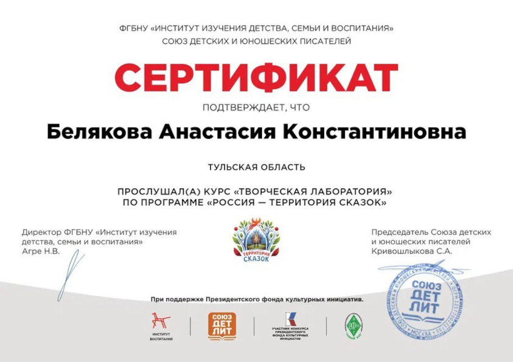
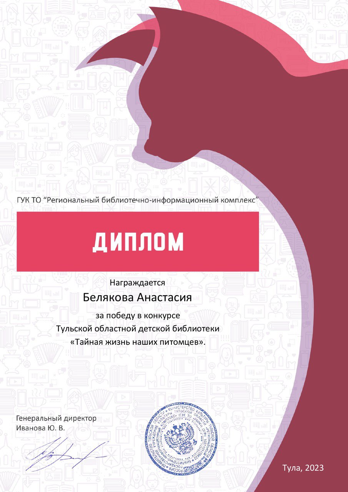
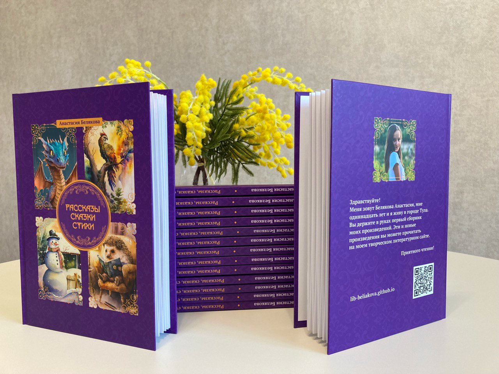
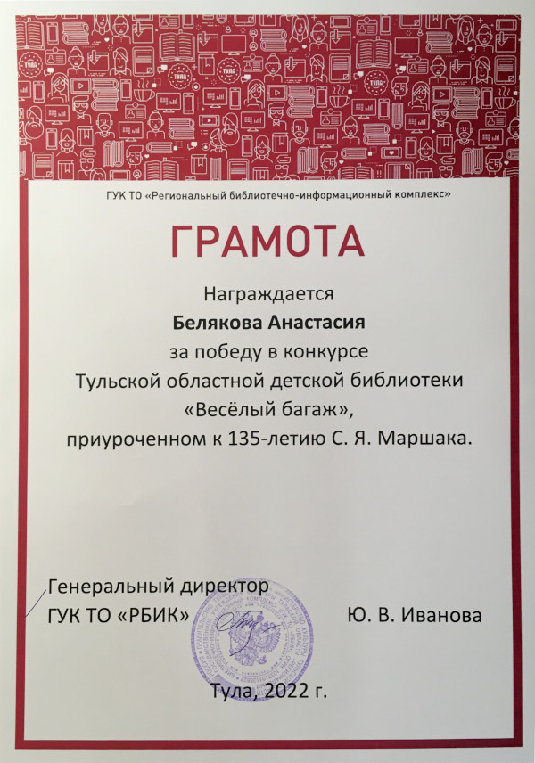

# Новости

!!! info "Новости в Telegram и VK"
    Чтобы не пропускать новости, подпишитесь на [канал сайта в Telegram :fontawesome-brands-telegram:](https://t.me/lib_beliakova) или [страницу ВКонтакте :fontawesome-brands-vk:](https://vk.com/lib_beliakova).

## 31.03.2023: Писательские курсы

Я прослушала курс лекций детской писательницы Евгении Малинкиной "Творческая лаборатория". Курс организован "Союзом детских и юношеских писателей".

??? note "Сертификат"
    

## 21.03.2023: Рассказ "Пробуждение от спячки"

Под весенними лучами все согреваются и становятся добрее. О приходе тепла и пробуждении от зимнего сна говорится в моём новом произведении -- [Пробуждение от спячки](stories/awakening-from-hibernation.md).

## 14.03.2023: Стихотворение "Ослик"

Этот стих посвящается ослику Паше из конюшни центрального парка моего города. О доброте и мечтах читайте в моём новом произведении -- [Ослик](poems/donkey.md).

## 07.03.2023: Рассказ "Подарок"

Наступил март -- месяц кошечек. Кто не любит кошек? Ведь они такие мягкие, пушистые, они мурчат и приносят в дом умиротворение... А ещё они цветоводы, принцессы и просто обожают шалить! О проказах кошки Машки, жившей у моих родителей, читайте в моём новом рассказе -- [Подарок](stories/present-mashka.md). Это произведение победило в конкурсе "Тайная жизнь наших питомцев", который проводила Тульская областная детская библиотека и награждено дипломом.

??? note "Диплом Тайная жизнь наших питомцев"
    

## 22.02.2023: Издан сборник моих произведений

Напечатана моя первая книга -- "Рассказы, сказки, стихи". В неё вошли некоторые произведения с этого сайта. Тираж разлетится по детским библиотекам.

??? note "Моя книга"
    

## 15.02.2023: Писательские курсы

Я прослушала курс лекций детской писательницы Екатерины Матюшкиной "Писательское мастерство детям". Курс организован "Союзом детских и юношеских писателей".

??? note "Сертификат"
    

## 11.02.2023: Иллюстрации на сайте

Теперь у всех произведений на моём сайте есть иллюстрации. Рисунки созданы нейросетью на основе фрагментов моих произведений.

## 05.02.2023: Рассказ "Лето, в которое случилось это"

Куда бежит бабушкин петух Петька? Что в таинственной посылке? Читайте новый рассказ о летних приключениях городского мальчика Васи в деревне -- [Лето, в которое случилось это](stories/summer.md). Этот рассказ -- домашнее задание онлайн-курса "Творческая лаборатория", организованного "Союзом детских и юношеских писателей".

## 02.02.2023: Стихотворение "Стояла осень..."

Этот стих появился благодаря прочтению произведения Паустовского "Барсучий нос". Читайте новое стихотворение об осеннем утре -- [Стояла осень...](poems/it-was-autumn.md)

## 30.01.2023: Конкурс от издательства "Мелик-Пашаев"

Мой рассказ [Как Петя заварил кашу](stories/petya.md) принял участие в конкурсе от издательства "Мелик-Пашаев" и попал в лонг-лист.

## 13.01.2023: Стихотворение "Тихо трепещет заснеженный лес..."

Если кончились новогодние каникулы, то это вовсе не значит, что и чудеса кончились! Ведь они окружают нас повсюду, например, в природе. Читайте мой новый стих, посвящённый чудесам зимней природы -- [Тихо трепещет заснеженный лес...](poems/forest-is-quivering.md) Это стихотворение я написала в преддверии Старого Нового года.

## 04.01.2023: Иллюстрации к стихам

Теперь у моих [стихов](poems/index.md) появились иллюстрации.

## 29.12.2022: Благодарность

Историко-культурный и природный музей-заповедник И. С. Тургенева "Бежин луг" отметил моё стихотворение [В деревне](poems/country.md) благодарственным письмом.

??? note "Благодарность"
    

## 09.12.2022: Стихотворение "На коньках"

Начался декабрь -- последний месяц года! Все стремятся в парк, прокатиться на коньках по свежему искристому льду. Моё новое стихотворение [На коньках](poems/skating.md) -- именно о таких моментах.

## 27.11.2022: Музыкальный канал на YouTube

Теперь у меня есть [Канал на YouTube](https://www.youtube.com/@a-tunes), где буду выкладывать популярные мелодии в моём исполнении на фортепиано.

## 25.11.2022: Аудиосказки

Теперь в разделе [Сказки](tales/index.md) вы можете не только читать, но и слушать сказки, озвученные автором.

## 25.11.2022: Стихотворение "После грозы"

Когда недавно отгремела гроза и небо только-только расчистилось от туч, закат кажется просто волшебным. Такие воспоминания и легли в основу моего нового стиха -- [После грозы](poems/after-storm.md).

## 12.11.2022: Окончание рассказа "Однажды, под нашим домом..."

Как важно всегда заканчивать начатое! Наконец-то я дописала давно начатый рассказ в стиле фэнтези -- [Однажды, под нашим домом...](stories/under-our-house.md).

## 07.11.2022: Стихотворение о птицах

Близятся холода и птицам станет трудно добывать себе пищу. Но мы можем помочь, оставив им в кормушках вкусное угощение! Ведь так приятно наблюдать за тем, как маленькие птахи слетаются на корм, качаются на веточках и нетерпеливо прыгают... Такие мысли и воспоминания вдохновили меня на написание нового стиха -- [Птичий обед](poems/avian-dinner.md).

## 05.11.2022: Стихотворение о зиме

Идёт последний месяц осени! Совсем скоро подуют метели, засвистят ветра, пруды и реки засверкают, как льдистые зеркала... Моё новое стихотворение -- [Шаги зимы](poems/winter.md) -- как раз о приходе этого холодного, но по-своему прекрасного времени года.

## 05.11.2022: Результаты конкурса "Весёлый багаж"

Мои [загадки](riddles.md) участвовали в конкурсе "Веселый багаж".

??? note "Грамота"
    

## 27.10.2022: Сказка о Маше-Растеряше

Порой поход в магазин за новым платьем может обернуться неожиданным приключением. Особенно, если поблизости окажется добропорядочный дракон. В такое приключение и попала царевна Маша, главная героиня моей новой юмористической истории -- [Сказки о Маше-Растеряше](tales/Masha-rasteryasha.md).

## 23.10.2022: Стих о рассвете

Утро -- поистине волшебное время. Небо покрывается нежным румянцем, свежий ветерок залетает в комнату... Моё новое произведение -- стихотворение [В ожидании рассвета](poems/before-sunrise.md) -- именно о такой поре.

## 20.10.2022: Канал в Telegram

У меня появился [канал в Telegram :fontawesome-brands-telegram:](https://t.me/lib_beliakova). Я буду публиковать там анонсы новинок этого сайта. Подписывайтесь!

## 15.10.2022: Стих о закате

В тёплых лучах заходящего солнца мир начинает казаться иным. Закатный свет проникает в самое сердце, пробуждая вдохновение. Сегодня вечером в такие минуты я и написала стих [На закате](poems/sunset.md).

## 14.10.2022: Стихотворение о море

Каждому автору знаком творческий кризис. Кому-то помогает чашка чая, кому-то -- пробежка. Ну а мне приносит вдохновение море. Об этом и говорится в моём новом стихе [Берег поэзии](poems/coast-of-poetry.md).

## 13.10.2022: Литературная гостиная 

Сегодня в моей школе проходил конкурс чтецов "Литературная гостиная", посвящённый Дню Отца. Я приняла участие, прочитав собственное стихотворение [Мой папа](poems/my-dad.md), и получила сертификат.

??? note "Сертификат участника"
    

## 12.10.2022: Новый стих про осень

Читайте новинку! Свежее стихотворение [Осенний парад](poems/autumn-parade.md).

## 08.10.2022: Новый стих про папу

Читайте новинку -- стихотворение [Мой папа](poems/my-dad.md).

## 03.10.2022: Конкурс "Веселый багаж"

Мои [загадки](riddles.md) приняты на конкурс "Веселый багаж". Этот конкурс [проводит Тульская областная детская библиотека](https://tulaodb.ru/news/?ELEMENT_ID=10206) к 135-летию со дня рождения Самуила Яковлевича Маршака.

## 02.10.2022: Новые стихи

Читайте новинки: стихотворения [В деревне](poems/country.md)  и [Осень](poems/autumn.md)!

## 30.09.2022: Сайт опубликован

Мой сайт опубликован! Ура!
