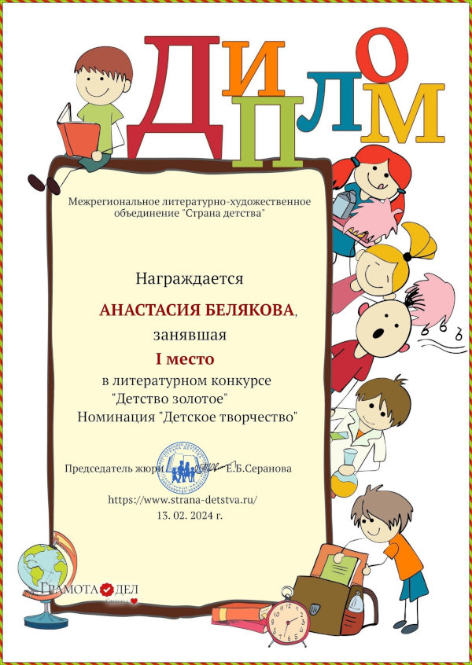
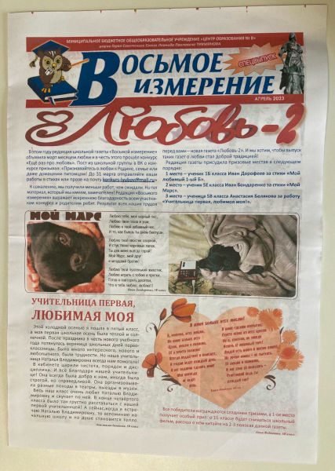
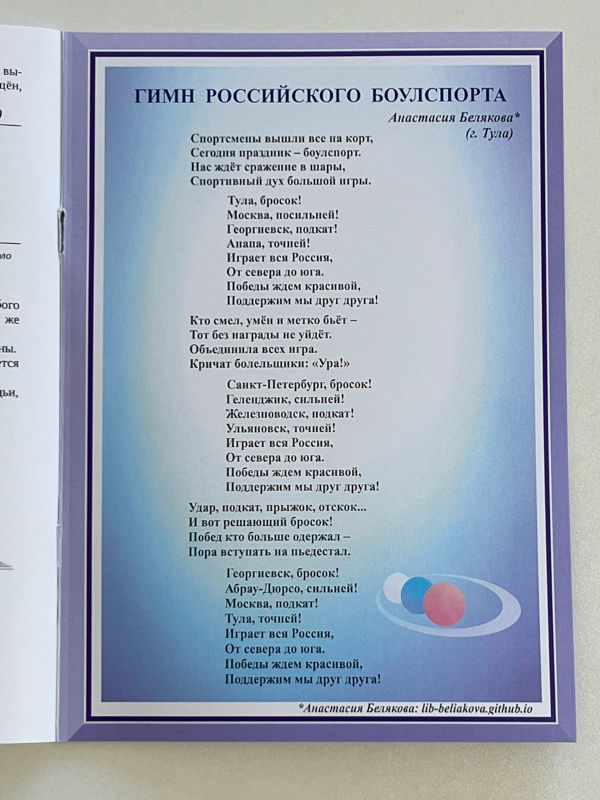

# Новости

!!! info "Новости в Telegram и VK"
    Чтобы не пропускать новости, подпишитесь на [канал сайта в Telegram :fontawesome-brands-telegram:](https://t.me/lib_beliakova) или [страницу ВКонтакте :fontawesome-brands-vk:](https://vk.com/lib_beliakova).

## 14.03.2024: Мои публикации

* [Публикации в печатных изданиях](achievements.md#print-media)
* [Публикации в электронных изданиях](achievements.md#online-media)

## 14.03.2024: Ещё три стихотворения для детей

Мои новые стихотворения для детей победили в литературном конкурсе "Детство золотое", который проводило межрегиональное литературно-художественное объединение "Страна детства".

??? note "Диплом конкурса \"Детство золотое\""
    

Читайте новинки:

* [Фотоаппарат](poems/photo-camera.md)
* [Строители](poems/builders.md)
* [Шедевр](poems/masterpiece.md)

## 12.03.2024: Творческая встреча

По приглашению Пушкинской библиотеки моего города я провела творческую встречу с пятиклассниками одной из тульских школ. Говорили о стихосложении, прозе, фанфиках, затронули тему нейросетей. Особенный интерес у ребят вызвал вопрос, как издать свою книгу. В конце мероприятия самая активная участница получила в подарок книгу. Спасибо библиотеке за приглашение, а ребятам -- за интерес и участие!

## 06.03.2024: Встреча с читателями и стихотворение "Восьмое марта"

В преддверии Международного женского дня я провела встречу с читателями. Я рассказала первоклассникам о стихосложении, почитала свои произведения и подарила всем авторские праздничные открытки со своим стихотворением [Восьмое марта](poems/march-8.md). На открытках ребята написали поздравления для мам и бабушек.

## 29.02.2024: Рассказ "Звёзды меж ветвей"

За несколько часов до весны всё становится другим, особенно в окутанном золотистым светом фонарей парке. Но только под покровом елей можно увидеть, как зажигаются [Звёзды меж ветвей](stories/stars.md).

## 22.02.2024: Статья "Яблочки с дуба"

Однажды, гуляя осенью по парку, я заметила на обратной стороне дубовых листьев странные наросты, похожие на маленькие яблочки. Что же это такое? Узнаете из новой статьи [Яблочки с дуба](blog/posts/oak-apples.md) в моём блоге.

## 12.02.2024: Новые стихотворения для детей

Кто умеет удивительно преображать мир, раскрашивая его во все цвета радуги? А кому доверить сокровенный секрет? Узнаете из моих новых стихотворений -- [Братья-пузыри](poems/bubbles.md) и [Тайна](poems/secret.md)!

## 28.01.2024: Стихотворение "Линии чернил"

Поэзия и проза наделены по-настоящему удивительной силой -- хоть они и не несут в себе зрительные представления, в строках всегда появляется и оживает яркий образ. Особенно это видно в вечных произведениях классики. Например, собирательный образ Тургеневских девушек сложился не из рисунков, а из строк. Это уникальная магия слова, которая пронизывает всю литературу, и которую я попробовала описать в своём новом стихотворении [Линии чернил](poems/ink-lines.md).

## 25.01.2024: Новые победы

Раздел [Достижения](achievements.md) пополнился двумя дипломами.

За стихотворение [Двенадцать](poems/twelve.md):

??? note "Диплом конкурса \"Разноцветные сезоны\""
    

За рассказ [Подарок](stories/present-mashka.md):

??? note "Диплом конкурса \"Семейный истории\""
    

## 21.01.2024: Статья "Сосед сверху"

Недавно над нашей квартирой поселился интересный жилец. С ним вы познакомитесь в моём блоге: [Сосед сверху](blog/posts/upstairs-neighbor.md).

## 14.01.2024: Стихотворение "Зимний сон"

Когда заканчиваются новогодние праздники, уже хочется тепла и наступления лета, как в моём новом стихотворении [Зимний сон](poems/winter-dream.md).

## 07.01.2024: Стихотворение "Двенадцать"

Начинаю новый творческий год с нового стихотворения [Двенадцать](poems/twelve.md)! В нём вы встретитесь со всеми месяцами года.

## 01.01.2024: Когда же родилась ёлочка?

Без песенки "В лесу родилась ёлочка" нельзя представить новогодних праздников. Как же она появилась? Узнаете из моего сюжета, снятого школьной телестудией.

<iframe width="560" height="315" src="https://www.youtube.com/embed/iFPlFkF1x0w?si=qI8T4ktWW43WstfY" title="YouTube video player" frameborder="0" allow="accelerometer; autoplay; clipboard-write; encrypted-media; gyroscope; picture-in-picture; web-share" allowfullscreen></iframe>

## 29.12.2023: Новогоднее прочтение стихотворения "Тихо трепещет заснеженный лес..."

Поздравляю вас с наступающим Новым годом! Пусть он принесёт с собой только хорошее! В преддверии праздника я хочу поделиться с вами новогодним прочтением своего стихотворения [Тихо трепещет заснеженный лес](poems/forest-is-quivering.md).

!!! audio "Слушать стихотворение"
    <audio controls preload="metadata" style="width: 100%">
        <source src="/audio/poems/forest-is-quivering.ogg" type="audio/ogg">
        <source src="/audio/poems/forest-is-quivering.mp3" type="audio/mpeg">
        Ваш браузер не поддерживает воспроизведение звука на странице.
        Вы можете <a href="/audio/poems/forest-is-quivering.mp3">скачать аудио</a>.
    </audio>

## 28.12.2023: Мои комментарии к рассказу "Первый на орбите"

Рассказ "Первый на орбите" содержит множество отсылок к популярным произведениям массовой культуры, а также к известным стереотипам о повадках котиков. Наверняка, многие из них вы заметили, когда читали этот рассказ в первый раз. Но все ли отсылки вы нашли? Сегодня я добавила в текст рассказа сноски с комментариями. Если вы интересуетесь научной фантастикой, компьютерными играми и заодно любите котиков -- [перечитайте рассказ еще раз](stories/first-in-orbit.md), теперь с авторскими комментариями в сносках!

## 20.12.2023: Рассказ "Пуговица"

Приятных предновогодних домашних хлопот! Тёплых воспоминаний от внезапно найденной в укромном уголке старой вещи, как в моей новой миниатюре [Пуговица](stories/button.md).

## 12.12.2023: Стихотворение "Зимняя прогулка"

Уютные зимние дни можно провести по-разному: закутавшись в тёплый плед пить чай, отправиться по модным магазинам, собраться в гости к друзьям... А можно навестить парковых белочек, как в моём новом стихотворении [Зимняя прогулка](poems/winter-walk.md).

## 29.11.2023: Видео "Гимн российского боулспорта"

К моим стихам [Гимн российского боулспорта](boulsport/anthem.md) была написана музыка. Исполнение гимна солистами Тульской областной филармонии слушайте и смотрите на [видео](https://youtu.be/Wo4Lbd6_pWI?si=qfR-QdKHwJ9MTZq_).

## 20.11.2023: Стихотворение "Птичий обед" награждено дипломом

Стихотворение [Птичий обед](poems/avian-dinner.md) награждено дипломом за победу во всероссийском конкурсе "Птичьи истории", который проводило литературно-художественное объединение "Страна детства".

??? note "Диплом \"Птичьи истории\""
    

## 20.11.2023: Рассказ "Киты и коты"

К 105-летию со дня рождения Бориса Заходера (по мотивам стихотворения "Кот и кит") я написала новый рассказ [Киты и коты](stories/whales-and-cats.md). Это произведение победило в конкурсе "Заходер и все-все-все", который проводила Тульская областная детская библиотека.

??? note "Диплом \"Заходер и все-все-все\""
    

## 13.11.2023: Стихотворение "Потеря"

Я написала новое стихотворение [Потеря](poems/loss.md), ведь люди часто что-то теряют. К счастью, пропажи находятся. Но всегда ли всё так просто?

## 13.11.2023: Видео-сюжет по очерку "Тургеневские острова"

Сюжет "Тургеневские острова" с моим участием, снятый в школьной телестудии размещён в статье [Тургеневские острова](blog/posts/turgenev-islands.md).

## 04.11.2023: Очерк "Тургеневские острова"

9 ноября 2023 года исполнится 205 лет со дня рождения Ивана Сергеевича Тургенева. Я написала очерк [Тургеневские острова](blog/posts/turgenev-islands.md), посвящённый малоизвестной истории из детства великого писателя.

## 12.10.2023: Стихотворение "Скверик осени"

Вот и пришла поздняя осень... Прогуливаясь по городскому скверику, я вдохновилась на новое стихотворение [Скверик осени](poems/garden-of-autumn.md). Ведь мелкий дождь и статные тополя могут рассказать нам свои истории...

## 30.09.2023: День рождения сайта

Ура! Моему сайту исполнилось двенадцать месяцев! Ровно год назад он был запущен, и на этой странице была опубликована первая новость! 🎉

За это время сайт посетило около 6000 читателей из 59 стран! Было опубликовано 20 новых стихов, 10 рассказов, 2 сказки, 2 фанфика, 7 загадок! Добавились добрые красочные иллюстрации в акварельном стиле. Появился новый раздел "Боулспорт", а главное -- издана моя первая книга "Рассказы, сказки, стихи"! Мои произведения публиковались в интернет-изданиях и в печатном виде.

Сайт обзавёлся соцсетями -- ВКонтакте и Телеграм. Спасибо подписчикам, что вы со мной!

За этот год я многому научилась, стараюсь совершенствовать свои навыки писательства, ведения блога. Спасибо всем за поддержку!

## 23.09.2023: Загадки

Я сочинила новые [загадки](riddles.md/#_6). Хотите попробовать отгадать? Чтобы потом проверить себя, нажмите на слово **Отгадка**, и вы увидите правильный ответ. Удачи!

## 08.09.2023: Рассказ "Чудо добра"

Чудо -- это не обязательно волшебство, сложная магия, единороги и огромные замки. Ведь чудо может сделать даже обычный школьник. Не верите? Прочтите мой новый рассказ [Чудо добра](stories/dinosaur.md) об удивительном происшествии в палеонтологическом музее!

## 16.08.2023: Дмитрий Кравченко читает моё стихотворение

Моё стихотворение [В ожидании рассвета](poems/before-sunrise.md) читает известный писатель и поэт Дмитрий Кравченко.

P.S. Сегодня у меня день рождения 🥳 -- получился отличный творческий подарок на двенадцатилетие! 🙂

## 07.08.2023: Стихотворение "Старый рояль"

Путешествуя по нашей стране, я встречала заброшенные дачи, дома. Таинственные узоры трещин на их стенах, шорох травы, выросшей в щелях, вдохновили меня на новый стих. Заголовок я ему дала по названию известной песни из кинофильма "Мы из джаза" -- [Старый рояль](poems/old-piano.md). При чём здесь рояль? Узнаете из стихотворения!

## 31.07.2023: Стихотворение "Старый дворец"

Лето -- прекрасная пора для путешествий. В давнюю пору было построено множество дворцов, которые теперь стали музеями. Я посетила один из таких музеев и в своём новом стихотворении [Старый дворец](poems/old-palace.md) описала свои эмоции от этой экскурсии.

## 15.07.2023: Рассказ "Как Петя заварил кашу"

Этот рассказ -- один из первых, опубликованных на моём сайте. Полгода назад я участвовала в конкурсе "Ох уж эти дети", который проводило издательство "Мелик-Пашаев". Специально для конкурса я переписала этот рассказ, чтобы он подходил для детей дошкольного возраста: сократила объём и поменяла некоторые сюжетные детали. Теперь я публикую на сайте [новую версию рассказа](stories/petya.md).

## 06.07.2023: Стихотворение "Ромашка"

Длинные библиотечные стеллажи могут скрывать в себе много тайн и историй. Причём не только книжных, но и настоящих. В своём новом стихотворении [Ромашка](poems/chamomile.md) я написала об одной неожиданной находке меж страниц старой книги.

## 29.06.2023: Детский литературный интернет-журнал "Мавочки и Дельчики"

В мае 2023 года меня приняли в постоянные авторы детского литературного интернет-журнала "Мавочки и Дельчики". Мой первый рассказ, опубликованный в 186-м номере этого журнала -- [Лето, в которое случилось это](stories/summer.md).

Бесплатный благотворительный журнал "Мавочки и Дельчики" выходит с 2007 года и распространяется по подписке. В нём на безвозмездной основе публикуются детские писатели и поэты. Основные читатели журнала  -- воспитанники детских домов. В России там воспитываются около 400 тысяч детей.

Если вы знаете контакты детских домов, приютов, школ-интернатов и прочих учреждений для неимущих детей, инвалидов и сирот, которые могли бы стать подписчиками журнала "Мавочки и Дельчики", пришлите их на мою электронную почту lib-beliakova@mail.ru.

## 23.06.2023: Стихотворение "Лето"

Читайте новое пейзажное стихотворение [Лето](poems/summer.md).

## 16.06.2023: Стихотворение "После грозы"

Я стараюсь постоянно совершенствовать свои писательские навыки, поэтому время от времени перечитываю и дорабатываю старые произведения. Сейчас лето -- пора гроз, и я решила обновить свой стих [После грозы](poems/after-storm.md).

## 08.06.2023: Очерк "Ясная Поляна"

Многие знают деревню Ясная Поляна, ведь в ней расположена усадьба великого писателя Льва Николаевича Толстого. Обычно туристы, приезжающие сюда, видят башни въезда, дом писателя, посещают могилу Льва Николаевича. И на этом знакомство с Ясной Поляной у большинства заканчивается. Но я хотела вам рассказать о немного другой Ясной Поляне... Из моего [очерка "Ясная Поляна"](blog/posts/Yasnaya-Polyana.md) вы узнаете о многих интересных и красивых местах неподалёку от знаменитой усадьбы. Вы можете использовать маршруты, описанные в нём, и посетить все эти места. В конце очерка я оставила ссылки на маршруты в Яндекс.Картах.

## 30.05.2023: Стихотворение "Коты-проказники"

Какой кот не любит пошалить? Все их проказы просто невозможно перечислить. Но я попыталась. В моём новом стихе [Коты-проказники](poems/cats.md) рассказывается о кошачьих шалостях, привычных и неожиданных.

## 29.05.2023: Книжный фестиваль "Красная площадь"

Крупнейший [литературный фестиваль](https://bookfestival.ru/) приглашает книголюбов на Красную площадь в Москве. Фестиваль пройдёт со 2 по 6 июня. Около 400 издательств со всей России представят на нём свои лучшие книги и новинки. В шатре №17 (регионы России) на стенде издательства "Свамия" вы можете приобрести мою книгу ["Рассказы, сказки, стихи"](https://vk.com/video796459389_456239017).

## 18.05.2023: Стихотворение "Легенда о Зелёной палочке"

Я написала [стихотворение "Легенда о Зелёной палочке"](poems/green-stick-legend.md), когда проходила курс "Мы -- начинающие поэты" под руководством детского поэта Оксаны Рахмановой. Сюжет стихотворения основан на легенде о [зеленой палочке](https://ru.wikipedia.org/wiki/%D0%97%D0%B5%D0%BB%D1%91%D0%BD%D0%B0%D1%8F_%D0%BF%D0%B0%D0%BB%D0%BE%D1%87%D0%BA%D0%B0), которую рассказал Л. Н. Толстому его старший брат.

## 11.05.2023: Моя заметка в газете "Восьмое измерение"

Я попробовала себя в роли корреспондента и написала для школьной газеты "Восьмое измерение" заметку про свою первую учительницу. Мою статью разместили на первой странице.

??? note "Заметка и диплом"
    

    

    

## 10.05.2023: Литературные курсы

Я прослушала курсы лекций, организованных "Союзом детских и юношеских писателей".

* Курс **"Литературные курсы блогеров"** провела детская писательница Наталья Спехова-Роси.
* Курс **"Мы -- начинающие поэты"** провела детский поэт и поэт-песенник Оксана Рахманова.
* Курс **"Сказкотворение. Курс по развитию креативности, воображения и фантазии"** провела детская писательница, председатель "Союза детских и юношеских писателей" Светлана Кривошлыкова.

??? note "Сертификаты о прохождении курсов"
    

    

    

## 02.05.2023: Произведения о боулспорте

На моём сайте появился новый раздел. Читайте [произведения о боулспорте](boulsport/index.md).

А ещё я хотела бы поделится с вами большим событием в моей писательской жизни. Я победила в поэтическом  конкурсе "Гимн/Марш боулспорта". Мой [гимн](boulsport/anthem.md) напечатали в брошюрах с правилами боулспорта тиражом несколько сотен экземпляров.

30 апреля состоялось торжественное награждение победителей конкурса. Выражаю огромную благодарность [Всероссийской федерации боулспорта](http://boulsport.ru/) и [Федерации боулспорта Тульской области](https://boulsport-tula.ru/).

??? note "Диплом и "Гимн российского боулспорта""
    

    

## 22.04.2023: Книга за подписку!

В моём Телеграм-канале проводится [розыгрыш](https://t.me/lib_beliakova/32) моей книги "Рассказы, сказки, стихи".

## 16.04.2023: Стихотворение "О весне"

Стихотворение [О весне](poems/about-spring.md) рассказывает о приходе тёплой весны в мой город. К этому стиху я сняла видео, в котором я читаю и играю на фортепиано. Видео вы найдёте под текстом произведения.

## 11.04.2023: Рассказ "Первый на орбите"

Космос манит всех на Земле. И вот однажды необычный космонавт отправляется на орбиту. Что произойдёт на Международной космической станции? Кто спасёт её экипаж? Читайте новый фантастический рассказ, написанный ко Дню космонавтики -- [Первый на орбите](stories/first-in-orbit.md).

## 04.04.2023: Рассказ "Соня полосатая"

Вы уже знакомы с Люсей из моего рассказа "Подготовка к празднику"? Читайте свежий рассказ о новых школьных приключениях Люси после весенних каникул -- [Соня полосатая](stories/sonya.md). Жанр и тему нового произведения выбрали подписчики моего Telegram-канала.

## 31.03.2023: Писательские курсы

Я прослушала курс лекций детской писательницы Евгении Малинкиной "Творческая лаборатория". Курс организован "Союзом детских и юношеских писателей".

??? note "Сертификат"
    

## 21.03.2023: Рассказ "Пробуждение от спячки"

Под весенними лучами все согреваются и становятся добрее. О приходе тепла и пробуждении от зимнего сна говорится в моём новом произведении -- [Пробуждение от спячки](stories/awakening-from-hibernation.md).

## 14.03.2023: Стихотворение "Ослик"

Этот стих посвящается ослику Паше из конюшни центрального парка моего города. О доброте и мечтах читайте в моём новом произведении -- [Ослик](poems/donkey.md).

## 07.03.2023: Рассказ "Подарок"

Наступил март -- месяц кошечек. Кто не любит кошек? Ведь они такие мягкие, пушистые, они мурчат и приносят в дом умиротворение... А ещё они цветоводы, принцессы и просто обожают шалить! О проказах кошки Машки, жившей у моих родителей, читайте в моём новом рассказе -- [Подарок](stories/present-mashka.md). Это произведение победило в конкурсе "Тайная жизнь наших питомцев", который проводила Тульская областная детская библиотека и награждено дипломом.

??? note "Диплом Тайная жизнь наших питомцев"
    

## 22.02.2023: Издан сборник моих произведений

Напечатана моя первая книга -- "Рассказы, сказки, стихи". В неё вошли некоторые произведения с этого сайта. Тираж разлетится по детским библиотекам.

??? note "Моя книга"
    

## 15.02.2023: Писательские курсы

Я прослушала курс лекций детской писательницы Екатерины Матюшкиной "Писательское мастерство детям". Курс организован "Союзом детских и юношеских писателей".

??? note "Сертификат"
    

## 11.02.2023: Иллюстрации на сайте

Теперь у всех произведений на моём сайте есть иллюстрации. Рисунки созданы нейросетью на основе фрагментов моих произведений.

## 05.02.2023: Рассказ "Лето, в которое случилось это"

Куда бежит бабушкин петух Петька? Что в таинственной посылке? Читайте новый рассказ о летних приключениях городского мальчика Васи в деревне -- [Лето, в которое случилось это](stories/summer.md). Этот рассказ -- домашнее задание онлайн-курса "Творческая лаборатория", организованного "Союзом детских и юношеских писателей".

## 02.02.2023: Стихотворение "Стояла осень..."

Этот стих появился благодаря прочтению произведения Паустовского "Барсучий нос". Читайте новое стихотворение об осеннем утре -- [Стояла осень...](poems/it-was-autumn.md)

## 30.01.2023: Конкурс от издательства "Мелик-Пашаев"

Мой рассказ [Как Петя заварил кашу](stories/petya.md) принял участие в конкурсе от издательства "Мелик-Пашаев" и попал в лонг-лист.

## 13.01.2023: Стихотворение "Тихо трепещет заснеженный лес..."

Если кончились новогодние каникулы, то это вовсе не значит, что и чудеса кончились! Ведь они окружают нас повсюду, например, в природе. Читайте мой новый стих, посвящённый чудесам зимней природы -- [Тихо трепещет заснеженный лес...](poems/forest-is-quivering.md) Это стихотворение я написала в преддверии Старого Нового года.

## 04.01.2023: Иллюстрации к стихам

Теперь у моих [стихов](poems/index.md) появились иллюстрации.

## 29.12.2022: Благодарность

Историко-культурный и природный музей-заповедник И. С. Тургенева "Бежин луг" отметил моё стихотворение [В деревне](poems/country.md) благодарственным письмом.

??? note "Благодарность"
    

## 09.12.2022: Стихотворение "На коньках"

Начался декабрь -- последний месяц года! Все стремятся в парк, прокатиться на коньках по свежему искристому льду. Моё новое стихотворение [На коньках](poems/skating.md) -- именно о таких моментах.

## 27.11.2022: Музыкальный канал на YouTube

Теперь у меня есть [Канал на YouTube](https://www.youtube.com/@a-tunes), где буду выкладывать популярные мелодии в моём исполнении на фортепиано.

## 25.11.2022: Аудиосказки

Теперь в разделе [Сказки](tales/index.md) вы можете не только читать, но и слушать сказки, озвученные автором.

## 25.11.2022: Стихотворение "После грозы"

Когда недавно отгремела гроза и небо только-только расчистилось от туч, закат кажется просто волшебным. Такие воспоминания и легли в основу моего нового стиха -- [После грозы](poems/after-storm.md).

## 12.11.2022: Окончание рассказа "Однажды, под нашим домом..."

Как важно всегда заканчивать начатое! Наконец-то я дописала давно начатый рассказ в стиле фэнтези -- [Однажды, под нашим домом...](stories/under-our-house.md).

## 07.11.2022: Стихотворение о птицах

Близятся холода и птицам станет трудно добывать себе пищу. Но мы можем помочь, оставив им в кормушках вкусное угощение! Ведь так приятно наблюдать за тем, как маленькие птахи слетаются на корм, качаются на веточках и нетерпеливо прыгают... Такие мысли и воспоминания вдохновили меня на написание нового стиха -- [Птичий обед](poems/avian-dinner.md).

## 05.11.2022: Стихотворение о зиме

Идёт последний месяц осени! Совсем скоро подуют метели, засвистят ветра, пруды и реки засверкают, как льдистые зеркала... Моё новое стихотворение -- [Шаги зимы](poems/winter.md) -- как раз о приходе этого холодного, но по-своему прекрасного времени года.

## 05.11.2022: Результаты конкурса "Весёлый багаж"

Мои [загадки](riddles.md) участвовали в конкурсе "Веселый багаж".

??? note "Грамота"
    

## 27.10.2022: Сказка о Маше-Растеряше

Порой поход в магазин за новым платьем может обернуться неожиданным приключением. Особенно, если поблизости окажется добропорядочный дракон. В такое приключение и попала царевна Маша, главная героиня моей новой юмористической истории -- [Сказки о Маше-Растеряше](tales/Masha-rasteryasha.md).

## 23.10.2022: Стих о рассвете

Утро -- поистине волшебное время. Небо покрывается нежным румянцем, свежий ветерок залетает в комнату... Моё новое произведение -- стихотворение [В ожидании рассвета](poems/before-sunrise.md) -- именно о такой поре.

## 20.10.2022: Канал в Telegram

У меня появился [канал в Telegram :fontawesome-brands-telegram:](https://t.me/lib_beliakova). Я буду публиковать там анонсы новинок этого сайта. Подписывайтесь!

## 15.10.2022: Стих о закате

В тёплых лучах заходящего солнца мир начинает казаться иным. Закатный свет проникает в самое сердце, пробуждая вдохновение. Сегодня вечером в такие минуты я и написала стих [На закате](poems/sunset.md).

## 14.10.2022: Стихотворение о море

Каждому автору знаком творческий кризис. Кому-то помогает чашка чая, кому-то -- пробежка. Ну а мне приносит вдохновение море. Об этом и говорится в моём новом стихе [Берег поэзии](poems/coast-of-poetry.md).

## 13.10.2022: Литературная гостиная

Сегодня в моей школе проходил конкурс чтецов "Литературная гостиная", посвящённый Дню Отца. Я приняла участие, прочитав собственное стихотворение [Мой папа](poems/my-dad.md), и получила сертификат.

??? note "Сертификат участника"
    

## 12.10.2022: Новый стих про осень

Читайте новинку! Свежее стихотворение [Осенний парад](poems/autumn-parade.md).

## 08.10.2022: Новый стих про папу

Читайте новинку -- стихотворение [Мой папа](poems/my-dad.md).

## 03.10.2022: Конкурс "Веселый багаж"

Мои [загадки](riddles.md) приняты на конкурс "Веселый багаж". Этот конкурс [проводит Тульская областная детская библиотека](https://tulaodb.ru/news/?ELEMENT_ID=10206) к 135-летию со дня рождения Самуила Яковлевича Маршака.

## 02.10.2022: Новые стихи

Читайте новинки: стихотворения [В деревне](poems/country.md)  и [Дыхание ноября](poems/autumn.md)!

## 30.09.2022: Сайт опубликован

Мой сайт опубликован! Ура!
