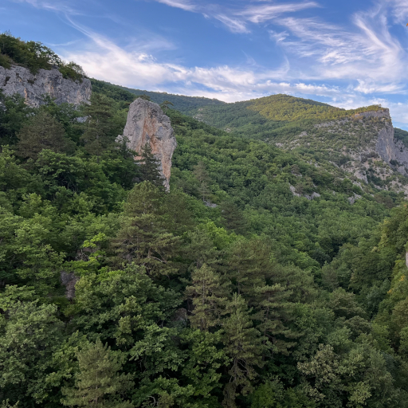

# Крымское

В одном ухе -- песня, в другом -- только дождь.  
Зовёт за собою раскатистый гром.  
За краем земли ты наверное ждёшь.  
У гор приютился мой маленький дом.

А я заблудилась средь скальных хребтов,  
Платанов и сосен, лаванды полей.  
Считаю ступени, бродячих котов,  
Проносятся чайки над крышей моей...

Пусть море внутри меня из берегов  
Выходит, стекая порой по щекам,  
Струится из ручки чернилами слов,  
Я, сидя у волн, улыбнусь облакам.

*13.07.2026 г., автору 14 лет.*

