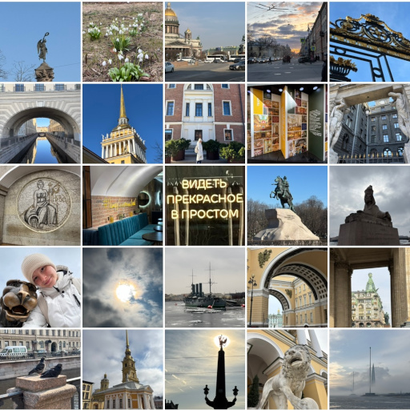

# С.П.

Пора расставаться. Спасибо за пышки,  
За песни, что чайки кричали на крыше,  
Я не позабуду их грустный мотив.  
За холодом дышащий Финский залив,

За невское солнце и за ледоход,  
За то, что в душе моей тронулся лёд.  
За выстрел полуденный, вид с колоннады,  
За ключик-брелок, мимолётные взгляды.

За каменных сфинксов и мраморных львов,  
Музеи, цитаты из чьих-то стихов.  
За шарф на плечах, гул вагонов метро,  
За слёзы и шёпот балтийских ветров.

Клянусь, я вернусь сквозь туманы и дождь,  
Лишь пообещай, что меня подождёшь.  
Ты стал для меня может больше, чем друг.  
Спасибо за всё. Не грусти, Петербург.

*04.02.2026 г., автору 14 лет.*

