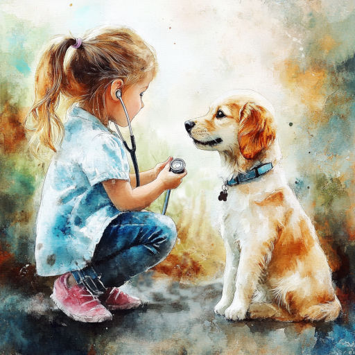

# Совет

Ты послушай, пёс!  
Верный дам совет.  
Если тёплый нос --  
То прогулкам нет.

Молока попей,  
Заберись в кровать.  
Станешь пободрей --  
И пойдёшь гулять!

*06.10.2024 г., автору 13 лет*

***

*Это стихотворение награждено дипломом за победу в поэтическом блиц-конкурсе "От улыбки станет всем светлей", который проводило межрегиональное литературно-художественное объединение "Страна детства".*

