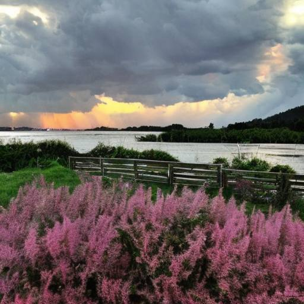

# После грозы

Закатный румянец залил небеса,  
Едва лишь утихла большая гроза.  
И тёмные тучи ушли на восток,  
А в воздух прокрался ночной холодок.

И глянуло солнце, наш город залив  
Небесным сияньем, дома озарив.  
Летят облака, розовея в лучах,  
И солнце дробится в вечерних волнах.

Средь тёмных кустов слышен свист соловья.  
А свист тот звучит, словно песня ручья.  
Тумана завеса плывёт над рекой,  
И гаснет небесный янтарь огневой.  

*2023 г., автору 11 лет.*

*Стихотворение напечатано в журнале "Поем, танцуем и рисуем" № 06 июнь 2023 (Москва).*

***

*Это произведение награждено дипломом за победу в Международном конкурсе "Пастернаковское лето", который проводила Центральная библиотека им. В.В. Розанова в Сергиевом Посаде.*

*Также это произведение награждено дипломом "Блёстки детского творчества" Международного Фонда ВСМ.*

