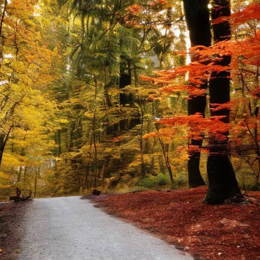

# Осенний парад

Яркий, красочный наряд  
Лес в честь осени надел.  
Звери вышли на парад,  
Ветер гимн лесной запел.

Закружились в хороводе  
Листья, ясные лучи.  
Заблестели чисты воды...  
К сказке нам даны ключи.

Мы вступаем в царство леса,  
Попадаем на парад.  
Разноцветные навесы  
Жарким пламенем горят.

У корней сидят опята.  
Шорох под ногой ковра.  
Вон под листьями маслята...  
Осень -- чудная пора!

*Октябрь 2022 г.*

