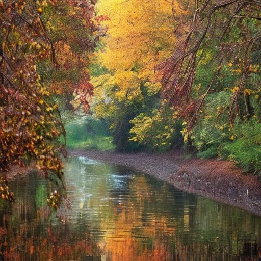

# Дыхание ноября

Дождя серебристые струны  
Искрятся. Пролился свет лунный.  
Река прочь несёт свои воды,  
Ворча от капризов природы.

Кружась, листья вновь облетают.  
Наш край журавли покидают.  
И ветер восточный вздыхает,  
Пора ноября наступает.

*2022 г., автору 11 лет.*

