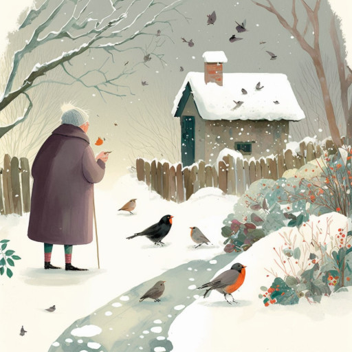

# Птичий обед

Морозы окутали скверы и парки,  
Белеют деревьев ажурные арки.  
Старушка неспешно идёт по дорожке,  
В кормушку кладёт угощений немножко.

Покушать слетелись голодные птицы:  
Снегирь и воробушек, рядом синица.  
Устроили пташки свой скромный обед.  
Сияет над городом солнечный свет.

Все прыгают, сильно качая сирень.  
Доели и ждут, что на завтрашний день  
Старушка к кормушке с пакетом придёт  
И семечек вкусных ещё принесёт!

*2023 г., автору 12 лет.*

*Стихотворение напечатано в журнале "Дружана" № 1, 2024 (Саратов).*

***

*Это стихотворение награждено дипломом за победу во всероссийском конкурсе "Птичьи истории", который проводило литературно-художественное объединение "Страна детства".*

