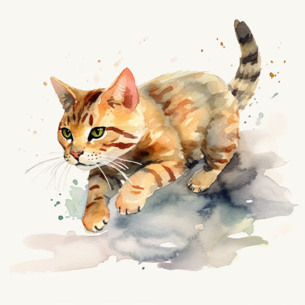
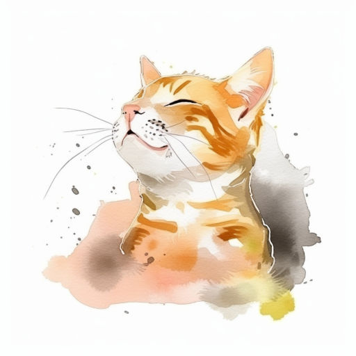
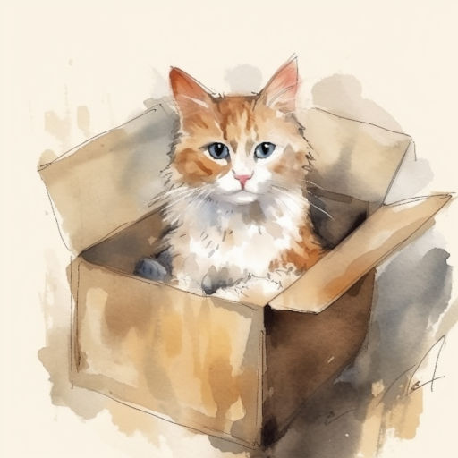
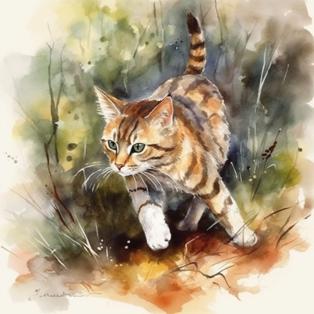
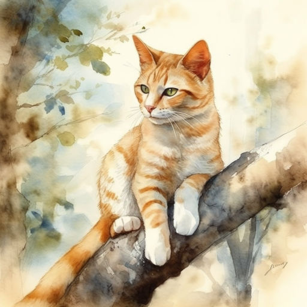
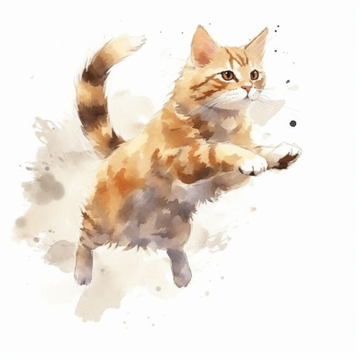
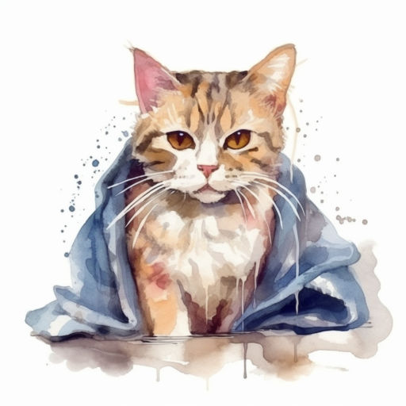
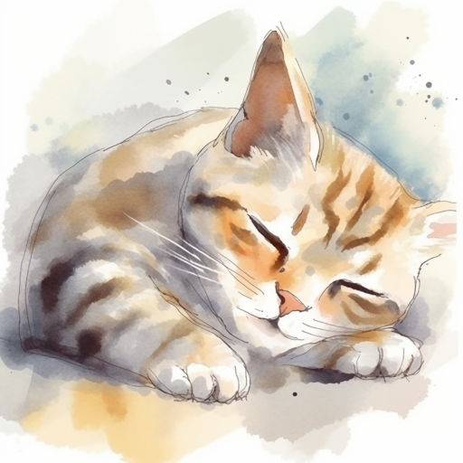
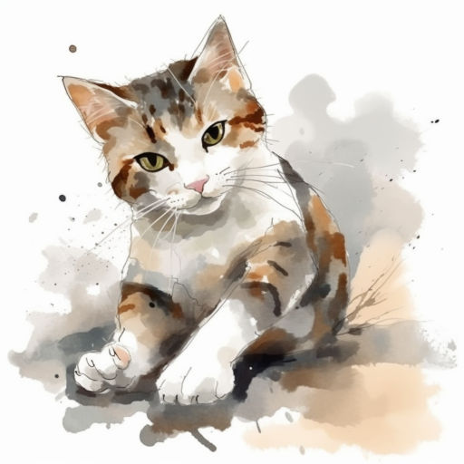

# Коты-проказники

Коты все -- проказники очень большие,  
В деревне живущие и городские.  
Проказы их нам не получится счесть --  
Всегда запасные у котиков есть!

В коробках коты посидеть обожают,  
Есть робот-уборщик? На нём разъезжают.  
Охотятся ловко в высокой траве,  
На дереве прячутся в сочной листве.

Коты отгрызают бутоны тюльпанам  
Под утро задорно шуршат целлофаном.  
Не любят купаться, а любят лежать,  
В объятьях хозяина тихо мурчать.

Что было поглажено -- тут же помято!  
Коты обожают тайком жевать мяту,  
Сырую картошку, закуска -- чабрец.  
Ещё любят грызть молодой огурец.

Всегда угощений котам будет мало!..  
Наевшись, заснут они под одеялом.  
Начальники в галстуках строгих сидят --  
Коты быть похожими очень хотят!

Но сколько бы наши коты не шалили,  
И сколько цветочных горшков ни валили,  
Всех прочих проказ вытворяли -- не счесть...  
Мы любим их! Рады, что котики есть!

*28.05.2023 г., автору 11 лет.*

---

Полистайте иллюстрации к стихотворению:

  
  
"Коты все – проказники очень большие"

  
  
"Проказы их все не получится счесть"

  
  
"Коты все в коробках сидеть обожают"

  
  
"Есть робот-уборщик? На нём разъезжают"

  
  
"Охотятся ловко в высокой траве"

  
  
"На дереве прячутся в сочной листве"

  
  
"...лезут на шторы с огромной сноровкой"

  
  
"Не любят купаться..."

  
  
"...а любят лежать"

  
  
"Что было поглажено – тут же помято!"

  
  
"Мы любим их! Рады, что котики есть!"

<a class="prev" onclick="plusSlides(-1)">❮</a>
<a class="next" onclick="plusSlides(1)">❯</a>

 

  
  
  
  
  
  
  
  
  
  
  

