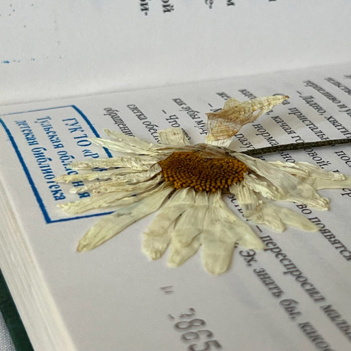

# Ромашка

> По мотивам стихотворения Александра Сергеевича Пушкина "Цветок".

Я в библиотеку вхожу поутру,  
Вступаю в обитель историй и грёз.  
Взглянув на названия, авторов вскользь  
Случайную книгу из шкафа беру.

Обложка узором ажурным блестит,  
Страницы пометок и сносок полны.  
И вдруг я смотрю: рядом с картой страны  
Сухая ромашка печально лежит.

Откуда она? Из свободных полей,  
Где ветер играет с пшеницей густой?  
А может, её ждал прилавок пустой:  
Ромашку продать торопились скорей?

Зачем же читатель её положил?  
Неужто хотел он цветок засушить?  
Мечтал ли кому-то его подарить?  
Тогда почему здесь ромашку забыл?

Где тот человек, что оставил цветок?  
Откуда он родом? А внешне каков?  
Узнает ромашку среди всех цветов?  
Он рядом с друзьями? Иль он одинок?

И вдруг вспоминаю, зачем я пришла:  
Для летнего чтения книгу искать.  
Цветок я не стану себе забирать.  
Вдруг эта ромашка кого-то ждала?

*25.06.2023 г., автору 11 лет.*

