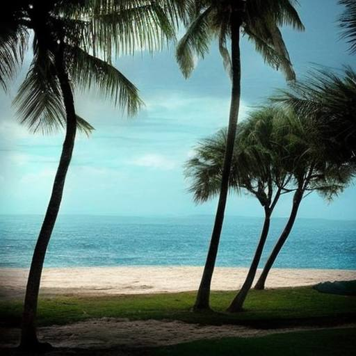

# Берег поэзии

Море шепчет, влагой дышит,  
Но не все из нас услышат  
В этом вздохе тихий зов,  
Голос дальних берегов.

Зелень пальм, жемчужин цвет  
И тропический обед.  
Свежий дождь, жара, прохлада...  
Что ещё поэту надо?  
Если только вдохновенья,  
Друга помощи, терпенья...

Нет! Всего не перечесть!  
Только знаю точно: есть  
Тёплый берег, что далёк,  
Музы тихий островок.  
И оттуда к нам Пегас  
Прилетит в заветный час.

Если нету вдохновенья,  
И прокисло настроенье,  
Я о море вспоминаю  
И о тех местах мечтаю.

*13.10.2022 г.*

