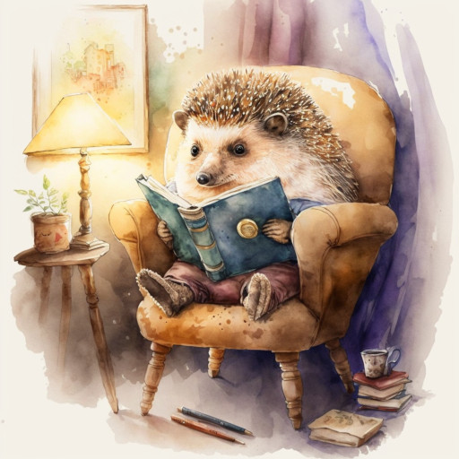

# Папа-ёж

Ёжик шел лесной тропой  
Не спеша к себе домой.  
Через лес осенний шёл,  
Под березой гриб нашёл.  
Насадил гриб на иголки  
И пошёл. Минул он ёлки.  
Папа-ёж шагал по лужам  
И ещё гриб обнаружил!  
Еле-еле насадился...  
Ёжик дальше покатился.  
Вот ещё грибок. Ещё!  
Вечером домой пришел.  
На колючках -- сто опят.  
Угостил своих ежат,  
В "Монополию" сыграл,  
На ночь сказку почитал.  
А потом весь день проспал.  
Вот как папа-ёж устал!  

*2022 г.*

