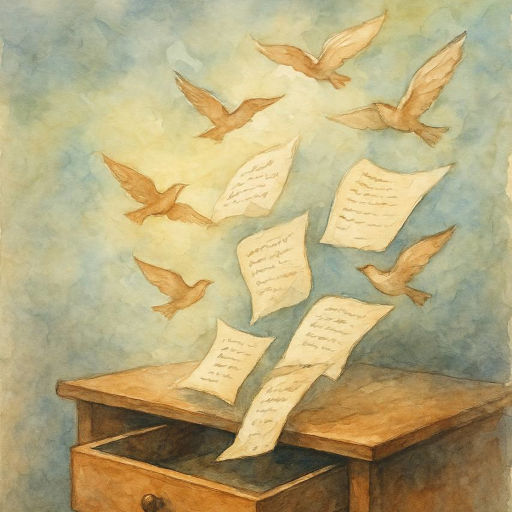

# Ящики стола

Я открываю ящики стола.  
Оттуда вылетают, словно птицы,  
Все те, кого однажды заперла  
В порыве в позабытую темницу.

Пытаюсь вспомнить: как и почему...  
Зачёркнут лист -- пустяк, нытьё поэта.  
Другой неинтересен никому,  
Жестоко провинился в рифме этот...

Писала, помню, в полночь, в полусне,  
А это -- на уроке, втихомолку,  
А это сочинила по весне.  
Неужто в этих строках нету толку?

Ленивой просто-напросто была!  
Как много незаконченных историй!  
Стихи расселись на краю стола.  
Начну с начала. Ящики закрою.

*12.10.2025 г., автору 14 лет.*

*Стихотворение напечатано в журнале "Золотой ключик" №1, 2026 (Липецк).*

