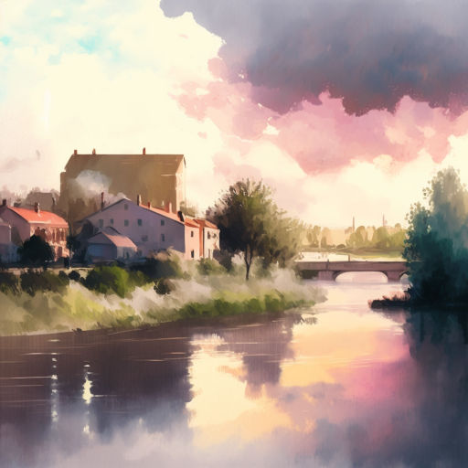

# Вечерняя весна

Вроде вечер, как вечер,  
Но всё нежно, весенне.  
Вдоль светлеющей речки  
Деревца зеленеют.

Облака, словно перья,  
Но застыли в полёте.  
Город ритм умерил,  
Став чуть ближе к природе.

В грустном вальсе над нами  
Кружат белые птицы.  
В розоватом тумане  
Старый день растворится.

*19.04.2025 г., автору 13 лет.*

