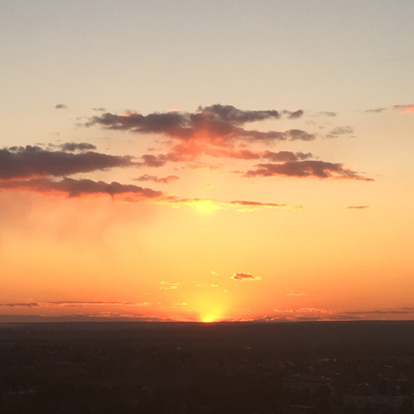

# Первое утро

Полумрак -- это тоже цвет.  
Провожаю я взглядом звёзды,  
Чтоб на кухне встречать рассвет,  
Ведь мечтать никогда не поздно.

Полусонный ещё Июнь,  
Поднимаясь над мягкой тучей,  
Улыбнётся -- задумчив, юн,  
И к лицу прикоснётся лучик.

Золотой мотылёк стучится --  
Выпускаю его в окно.  
Над домами кружатся птицы,  
Как когда-то вчера, весной.

Мир как будто чуть-чуть другой.  
Умываясь в потоках света,  
Просыпается город мой.  
Здравствуй, первое утро лета.

*01.06.2026 г., автору 14 лет.*

