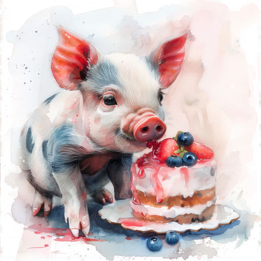

# Для меня!

Хозяйка под вечер однажды  
Оставила торт на столе.  
Не надо тут думать и дважды!  
Понятно, сюрприз этот -- мне!

Высокий, украшенный кремом,  
А розочек -- не сосчитать!  
Но тут же возникла проблема --  
Как вишенку сверху достать?

Копытца и ушки, и спинка  
В сюрпризе испачканы вмиг.  
Вздыхают все: «Что ты за свинка!»  
Да нет же! Ведь я -- мини-пиг!

*23.03.2024 г., автору 12 лет*

***

*Это стихотворение награждено дипломом за победу в поэтическом блиц-конкурсе "Милые проказники", который проводило межрегиональное литературно-художественное объединение "Страна детства".*

