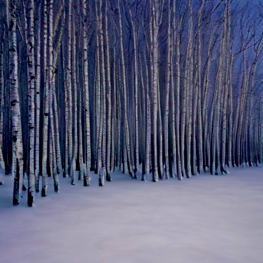

# Тихо трепещет заснеженный лес...

Тихо трепещет заснеженный лес.  
Воздух застыл в ожиданьи чудес.  
Вьюга лишь стихла, недавно витала.  
Звёзды чуть светят, Луна заблистала.  
А подо льдом речка робко сверкает,  
Где-то шуршит — снег с ветвей опадает.  
Между деревьев гуляют морозы.  
Мягко мерцают, искрятся берёзы.  
Вьётся позёмка с вершины холма...  
Это колдует над лесом зима...

*13.01.2023 г., автору 11 лет.*

