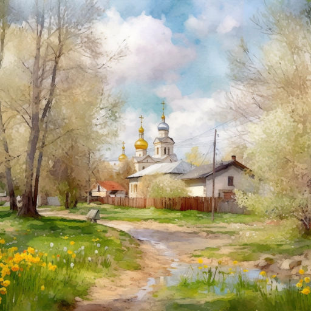

# Счастье

Что такое счастье? Это встретить  
Друга лучезарную улыбку.  
Счастье -- это вовремя заметить  
И исправить глупую ошибку.

Счастье -- это краткая записка  
На листе помятом из тетради.  
Счастье -- если родственники близко  
На судьбы превратности не глядя.

Счастье -- путешествовать по свету,  
А потом в свой край вновь возвратиться.  
Счастье, что его другого нету,  
Край родной в дороге долгой снится.

Счастье -- твёрдо знать: любовь не сказка,  
Не легенда дружба и призванье.  
Счастье -- дом, а в нём тепло и ласка.  
Что такое счастье? Это мама!

*23.03.2024 г., автору 12 лет*

*Стихотворение напечатано в журнале "Путеводная звезда" №6 (349), 2025 (Киров).*

