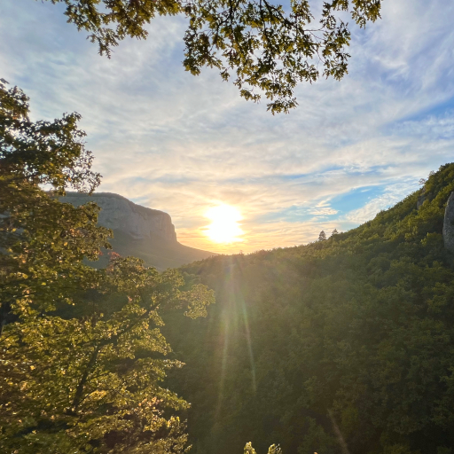

# Он

Он уйдёт, никому ничего не сказав.  
На камине припрячет письмо.  
Он уйдёт ровно в срок. И останется прав:  
Жёлтый лист пролетает -- и всё.

След ботинок теряется где-то вдали,  
Направляясь к туманной горе.  
Раз -- тропинки свели. Два -- опять развели,  
Как в какой-то нелепой игре.

Он вернётся... Конечно? Наверное? Нет?  
Вдруг уйдёт -- и уйдёт навсегда?  
Вновь уносит его золотящийся свет,  
Как кораблик уносит вода.

*25.08.2026 г., автору 15 лет.*

