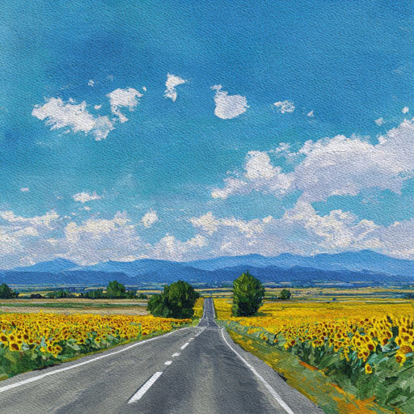

# Привет

План. Ожидание долгое. Споры,  
Сборы и груда вещей в коридоре.  
Реки, мелькание сосен, берёзок.  
Степи бескрайние, гроз отголосок.

«Прямо семьсот пятьдесят километров».  
Гонка с гуляющим по полю ветром.  
Полдень. Заправка. Борьба за хот-доги.  
Зной. Бесконечная лента дороги...

Скучно. В чернилах блокнота страницы.  
Птицы в окне. За станицей станица,  
В дымке вдали синеватые горы...  
Лето. Привет тебе, Чёрное море!

*02.11.2025 г., автору 14 лет.*

