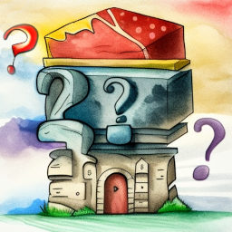

# Стихи

В этом разделе собраны мои стихи о природе, о животных, о детях, об их родителях, о школе, о вдохновении и многом другом. Стихотворения понравятся и взрослым и детям. Приятного чтения!

## Коты-проказники

Какой кот не любит пошалить? Все их проказы просто невозможно перечислить. Но я попыталась. В этом стихе рассказывается о кошачьих шалостях, привычных и неожиданных.

[:octicons-book-16: Читать](cats.md){ .md-button }

---

## Легенда о Зелёной палочке

Это стихотворение написано по мотивам [легенды о зеленой палочке](https://ru.wikipedia.org/wiki/%D0%97%D0%B5%D0%BB%D1%91%D0%BD%D0%B0%D1%8F_%D0%BF%D0%B0%D0%BB%D0%BE%D1%87%D0%BA%D0%B0), которую рассказал Л. Н. Толстому его старший брат.

[:octicons-book-16: Читать](green-stick-legend.md){ .md-button }

---

## О весне

Это стихотворение рассказывает о приходе тёплой весны в мой город. К стиху "О весне" я сняла видео, в котором я читаю и играю на фортепиано. Видео вы найдёте под текстом произведения.

[:octicons-book-16: Читать](about-spring.md){ .md-button }
[:fontawesome-brands-youtube: Смотреть](https://youtu.be/Qk4pw-Kf6Do){ .md-button }

---

## Ослик

Посвящается ослику Паше из конюшни центрального парка моего города. В этом стихе говорится о доброте и мечтах.

[:octicons-book-16: Читать](donkey.md){ .md-button }

---

## Берег поэзии

Каждому автору знаком творческий кризис. Кому-то помогает чашка чая, кому-то -- пробежка. Ну а мне приносит вдохновение море. Об этом и говорится в этом стихе.

[:octicons-book-16: Читать](coast-of-poetry.md){ .md-button }

---

## В ожидании рассвета

Утро -- поистине волшебное время. Небо покрывается нежным румянцем, свежий ветерок залетает в комнату… Это стихотворение именно о такой поре.

[:octicons-book-16: Читать](before-sunrise.md){ .md-button }

---

## На закате

В тёплых лучах заходящего солнца мир начинает казаться иным. Закатный свет проникает в самое сердце, пробуждая вдохновение. В такие минуты я и написала этот стих.

[:octicons-book-16: Читать](sunset.md){ .md-button }

---

## В деревне

Деревенское утро кажется особенным. Крики петухов, песня пастушьих рожков... В этом стихотворении я описала эти необыкновенные минуты  летнего рассвета.

[:octicons-book-16: Читать](country.md){ .md-button }

---

## Шаги зимы

Как я люблю зиму! Дуют метели, свистят ветра, пруды и реки сверкают, как льдистые зеркала… Это стихотворение как раз о приходе этого холодного, но по-своему прекрасного времени года.

[:octicons-book-16: Читать](winter.md){ .md-button }

---

## Осенний парад

Золотые дни сентября -- чудесное время! Резные листья кружатся в лёгком танце, белочки с интересом выглядывают из-за стволов... Это и вдохновило меня на создание этого стиха.

[:octicons-book-16: Читать](autumn-parade.md){ .md-button }

---

## На коньках

Как я люблю декабрь -- последний месяц года! Все стремятся в парк, прокатиться на коньках по свежему искристому льду. Это стихотворение именно о таких моментах.

[:octicons-book-16: Читать](skating.md){ .md-button }

## После грозы

Когда недавно отгремела гроза и небо только-только расчистилось от туч, закат кажется просто волшебным. Такие воспоминания и легли в основу этого стиха.

[:octicons-book-16: Читать](after-storm.md){ .md-button }

## Тихо трепещет заснеженный лес...

Если кончились новогодние каникулы, то это вовсе не значит, что и чудеса кончились! Ведь они окружают нас повсюду, например, в природе. Я написала это стихотворение в преддверии Старого Нового года.

[:octicons-book-16: Читать](forest-is-quivering.md){ .md-button }

## Стояла осень...

Золотая заря, золотые листья на деревьях... Осенний рассвет удивителен! В этом стихе говорится о первых минутах осеннего утра.

[:octicons-book-16: Читать](it-was-autumn.md){ .md-button }

## Осень

Дождливыми осенними ночами ветер печально вздыхает, плутая между голых деревьев. Такие часы поздней осени я описала в этом стихотворении.

[:octicons-book-16: Читать](autumn.md){ .md-button }

---

## Единорожка Серёжка

Аккуратность очень важна -- и людям, и единорогам. Это легко доказать на примере героя этого стиха -- единорожки Серёжки.

[:octicons-book-16: Читать](unicorn.md){ .md-button }

---

## У поэта так бывает...

У всех поэтов случается творческий кризис. В такие минуты не получается написать и строчки, кажется, что это навсегда. Об этом и говорится в стихе "У поэта так бывает..."

[:octicons-book-16: Читать](poets.md){ .md-button }

---

## Мой школьный день

Когда школьный день тянется, как резина, не терпится поскорее вернуться домой. Такие чувства знакомы каждому и именно они подтолкнули меня к созданию этого стиха.

[:octicons-book-16: Читать](my-school-day.md){ .md-button }

---

## Птичий обед

Когда наступают холода, птицам становится трудно добывать себе пищу. Но мы можем помочь, оставив им в кормушках вкусное угощение! Ведь так приятно наблюдать за тем, как маленькие птахи слетаются на корм, качаются на веточках и нетерпеливо прыгают… Такие мысли и воспоминания вдохновили меня на написание этого стиха.

[:octicons-book-16: Читать](avian-dinner.md){ .md-button }

## Мой папа

Папа -- важнейший человек. Он всегда поддержит твои идеи, поможет в трудной ситуации. Этот стих посвящён моему папе.

[:octicons-book-16: Читать](my-dad.md){ .md-button }

---

## Заяц

С самого раннего детства все знают о том, что зайцы меняют шубку. Это отлично маскирует зайчиков, скрывая от глаз хищников. О таком меховом круговороте и говорится в этом стихе.

[:octicons-book-16: Читать](the-hare.md){ .md-button }

---

## Папа-ёж

У всех пап много дел и забот. И не только у человеческих, но и у ежиных. О папе-еже и написан этот стих.

[:octicons-book-16: Читать](dad-hedgehog.md){ .md-button }

---

## Полезная запоминалочка

Все знают одиннадцать глаголов-исключений, относящихся ко второму спряжению. Когда я изучала эту тему, то сочинила этот небольшой стишок, в котором перечисляются эти глаголы.

[:octicons-book-16: Читать](zapominalochka.md){ .md-button }

---

## Первапрель

Первое апреля -- День Смеха, день, когда никому нельзя верить, ведь за каждым углом тебя ждёт весёлые подвохи и неожиданности. О первом дне апреля и говорится в этом стихе.

[:octicons-book-16: Читать](april.md){ .md-button }

---

## В гостях у вороны

Вы не представляете, как хорошо одна ворона умеет готовить макароны! О том, как провели время у неё в гостях звери, читайте в этом стихе.

[:octicons-book-16: Читать](the-crow.md){ .md-button }

---

## Помогаю

Всегда нужно помогать своим родителям! О моей помощи написано в этом стихотворении.

[:octicons-book-16: Читать](help.md){ .md-button }

## Читайте также

<a href="../stories">
<figure>
<figcaption>Рассказы</figcaption>
</figure></a>

<a href="../tales">
<figure>
<figcaption>Сказки</figcaption>
</figure></a>

<a href="../fanfics">
<figure>
<figcaption>Фанфики</figcaption>
</figure></a>

<a href="../riddles">
<figure>
<figcaption>Загадки</figcaption>
</figure></a>

