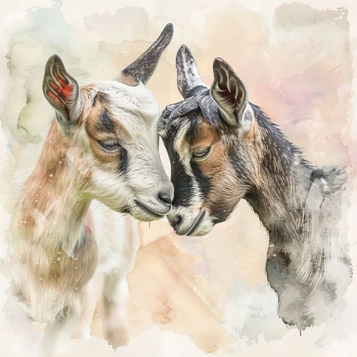

# Урок

Что за драка, друзья? Что за спор?  
Наблюдает внимательно двор.  
Только курам, увы, невдомёк,  
Что идёт здесь боданья урок!

*23.03.2024 г., автору 12 лет*

***

*Это стихотворение награждено дипломом за победу в поэтическом блиц-конкурсе "Милые проказники", который проводило межрегиональное литературно-художественное объединение "Страна детства".*

