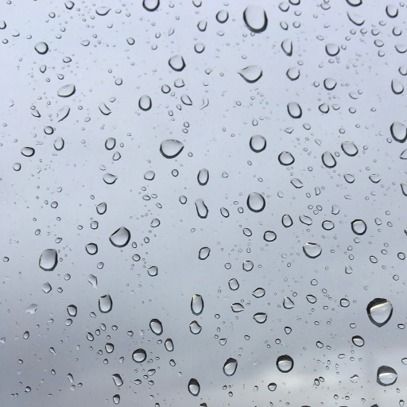

# Зайке

> По мотивам творчества Агнии Барто и Владимира Маяковского.

Лопоухий  
&emsp;&emsp;&emsp;&emsp;товарищ  
&emsp;&emsp;&emsp;&emsp;&emsp;&emsp;&emsp;&emsp;плюшевый  
заяц понял:  
&emsp;&emsp;&emsp;&emsp;видать,  
&emsp;&emsp;&emsp;&emsp;&emsp;&emsp;&emsp;&emsp;Танюшею  
подло брошен --  
&emsp;&emsp;&emsp;&emsp;&emsp;&emsp;&emsp;&emsp;и навсегда.  
На три четверти  
&emsp;&emsp;&emsp;&emsp;он --  
&emsp;&emsp;&emsp;&emsp;&emsp;&emsp;&emsp;&emsp;вода.  
Зай такой  
&emsp;&emsp;&emsp;&emsp;никому  
&emsp;&emsp;&emsp;&emsp;&emsp;&emsp;&emsp;&emsp;не нужен.  
Не ревёт --  
&emsp;&emsp;&emsp;&emsp;мир и так вон  
&emsp;&emsp;&emsp;&emsp;&emsp;&emsp;&emsp;&emsp;лужа.  
Со скамейки  
&emsp;&emsp;&emsp;&emsp;сырой  
&emsp;&emsp;&emsp;&emsp;&emsp;&emsp;&emsp;&emsp;не слезет.  
Не дождётся --  
&emsp;&emsp;&emsp;&emsp;в душе лишь  
&emsp;&emsp;&emsp;&emsp;&emsp;&emsp;&emsp;&emsp;плесень.

*2025 г., автору 13 лет.*

