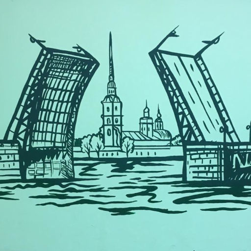

# Потеря

По жизни мы что-то находим.  
Мы ищем средь старых вещей,  
По улочкам в поисках бродим,  
Встречаем там новых людей.

Обновки себе покупаем,  
Животных спасаем в беде,  
Но часто, увы, забываем,  
Что можем терять в суете...

Потеряна шапка. Но всё же  
Пропажу свою я найду.  
Сомненья меня и не гложут.  
Я в школе её поищу. 

Пропала собака. Возможно  
Хоть кто-то, да видел её.  
Беглянка найдётся же, верно?  
Сжимается сердце моё.

Поссорилась с другом. Обида  
Как снежные комья растёт.  
Его мне в толкучке не видно --  
Мириться он сам не придёт.

Пропало доверье. Неужто  
Вернуть дружбу ту не смогу?  
Друг сразу становится нужным.  
Мне холодно, словно в пургу...

По жизни мы что-то теряем:  
Игрушки, потоки идей...  
Но их-то мы вновь обретаем.  
Сложней вернуть веру в друзей!

*28.10.2023 г., автору 12 лет*

> Рисунок выполнен творческим коллективом моей школы и изображает Дворцовый мост в Санкт-Петербурге.