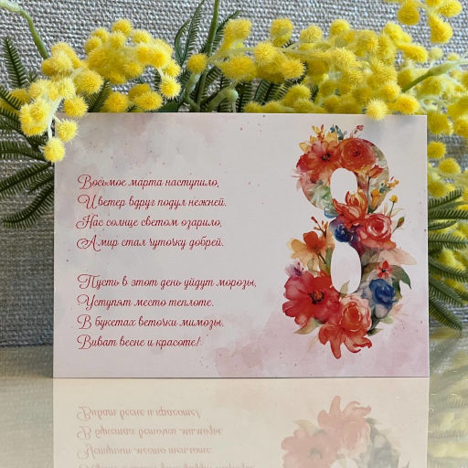

# Восьмое марта

Восьмое марта наступило,  
И ветер вдруг подул нежней.  
Нас солнце светом озарило,  
А мир стал чуточку добрей.

Пусть в этот день уйдут морозы,  
Уступят место теплоте.  
В букетах веточки мимозы.  
Виват весне и красоте!

*Январь 2024 г., автору 12 лет.*

***

Это стихотворение превратилось в праздничную открытку:

