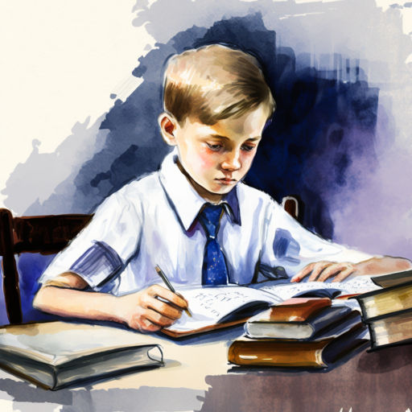

# Мой школьный день

Стул, доска, диктант, тетрадка,  
Мысли снова в беспорядке.  
Пять, четыре, три и два,  
Кашу варит голова.

Треугольник, круг, квадрат,  
Как я дома был бы рад!  
Отдыхал бы и играл!  
Прыгал, бегал и орал...

"Но жена не рукавичка"...  
За окном летит синичка...  
Два на два равно четыре,  
Ноги выше, руки шире!

Начинается физ-ра.  
Всё?! Пора домой? УРА-А!!!  
Стоп! Мне ж надо на продлёнку!..  
Вот бы стать сейчас котёнком...  
Я мурчал бы, лапкой мылся  
И ни в жизнь бы не учился!  
Нет ведь, должен тут сидеть  
И в тетрадочку глядеть!

Вот таблица, вот линейка...  
Три! Бежим домой скорей-ка!!!

*2020 г.*

