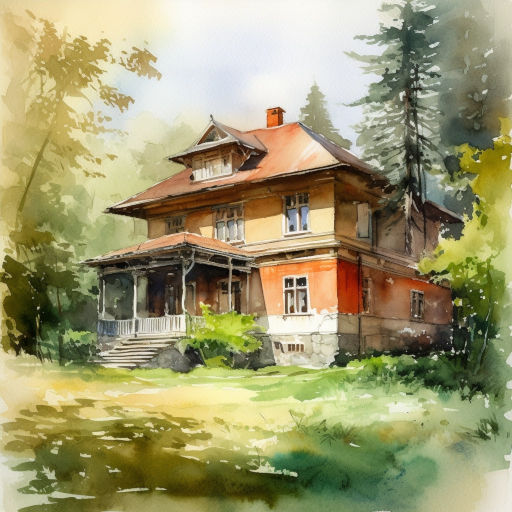

# Старый рояль

У покинутой дачи на речке  
Заколочены окна и дверь.  
Не ступала нога на крылечко,  
Ветер воет в трубе, словно зверь.

Дождь по крыше стучит частым градом,  
Осень где-то в тумане бредёт.  
А в саду сохнут плющ с виноградом.  
Пианиста рояль старый ждёт.

Он стоит тихо в тёмной гостиной,  
Паутиной и пылью покрыт.  
В этом доме одни лишь картины  
Помнят, как он прекрасно звучит.

Дождь затих. Всё вокруг онемело.  
Но нарушил молчание книг  
Скрип. Доска прочь с окна отлетела,  
Ловко в комнату мальчик проник.

Лет тринадцать ему. Он с опаской  
Осмотрелся, стянул капюшон,  
Снял рюкзак и баллончик взял с краской.  
Чуть помедлив, к стене подошёл.

Яркий луч белых клавиш коснулся,  
Мальчик вздрогнул. Нет, всё хорошо --  
Это солнце в окно заглянуло!  
Паренёк к инструменту пошёл.

Подошёл... И в лице изменился.  
Видно, давний урок вспоминал.  
Мальчик тихо на стул опустился,  
И рояль три аккорда сыграл.

Дом застыл, околдованный звуком,  
Ожидаемым несколько лет.  
И летали по клавишам руки,  
Старой песни играя куплет.

Вдруг послышался зов. Тут мальчишка  
Как споткнулся, со стула вскочил.  
Он в окно прошмыгнул, словно мышка,  
И дощечку поспешно закрыл.

Вот опять тень упала печально.  
Только замер счастливый рояль.  
Хоть бы мальчик в селе жил не дальнем,  
Чтобы чаще его навещал...

*01.08.2023 г., автору 11 лет.*

*Стихотворение напечатано в журнале “Художественное слово”, № 38 октябрь 2023.*

