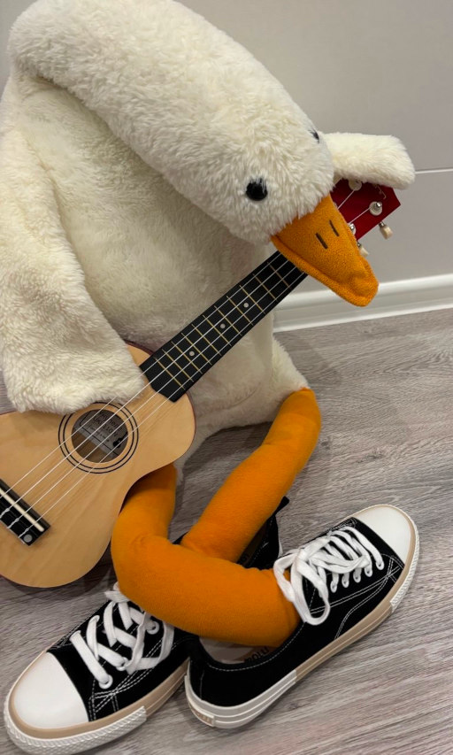

# Другие пути

Так трудно девчонке живётся на свете!  
Девчонка мечтает о парке, букете,  
Держаться за ручки мечтает, о звёздах...  
Пусть в мыслях всё ярко, реально и просто --  
А девочке к мальчику как подойти?  
С подругами ищет другие пути!

Проблема одна -- из другого он класса!  
И цифру, и букву узнают не сразу...  
Куда в раздевалке он крутку повесил?  
По номеру в списке найдут имя вместе!  
Тихонько потом наблюдают за ним:  
Он вечно с друзьями! Не ходит один...

Проблема вторая -- и что теперь делать?!  
Девчонка, собрав в кулак волю и смелость  
Проходит, "случайно" тетрадку роняет...  
Но он в телефоне -- и не замечает...  
На лестницах тесно. Где он? Где не он?  
А может быть это видение? Сон?

Вон в кедах таких же проходит мальчишка.  
Ах да! Это он! Только страшно ей слишком...  
Подруги щебечут девчонке советы,  
А что о нём знают? Лишь имя и кеды!  
Тогда на разведку выходят они,  
Тогда открывают соцсети и СМИ...

Но профиль закрытый подруги встречают.  
Отставить печаль! И они наблюдают...  
Он хлеб из столовой таскает в карманах?  
Болтает о спорте порой с пацанами?  
А на телефоне играет во что?  
Девчонки почувствовали скоро шок...

А он хулиган -- он у завуча вечно!  
Уроки прогуливает столь беспечно!  
Слова говорит -- что упал бы сапожник,  
Девчонку сбивает с ног неосторожно...

Решает девчонка: такой ей не нужен.  
А в парке гулять можно вместе с подружкой!

*19.03.2025 г., автору 13 лет.*

