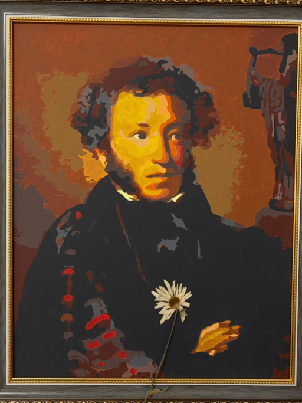

# Портрет

Словно Наполеон вы скрестили задумчиво руки,  
На лицо завитками ложатся блестящие кудри.  
В лёгкой полуулыбке — все мысли о верной подруге.  
В вашем взгляде искрится морозное зимнее утро.

Неизменно в своём красном клетчатом англицком шарфе,  
Вы глядите на нас с высоты, только не свысока,  
А за вашей спиной тихо муза играет на арфе,  
И мелодия льётся сквозь холст, через рифмы, в века.

*06.06.2026 г., автору 14 лет.*

