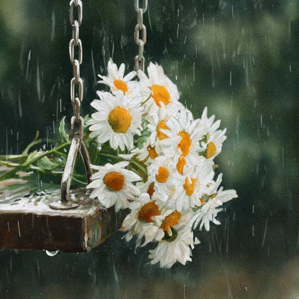

# Помнишь?

Ты мне дарил ромашки. Помнишь, Вась?  
Гуляли вместе, за руки держась.  
Делили шоколадку пополам,  
Взлетали на качелях к облакам...

Кружится лист. Прохладней вечера.  
Уходит тихо летняя пора.  
Ромашкам одиноко под дождём,  
Разлука наша ближе с каждым днём.

То счастье не вернуть уже назад.  
Прощай же, наш любимый детский сад!  
Судьба с тобой навеки развела.  
Ты в первый "Б" пошёл, я -- в первый "А".

*25.10.2025 г., автору 14 лет.*

