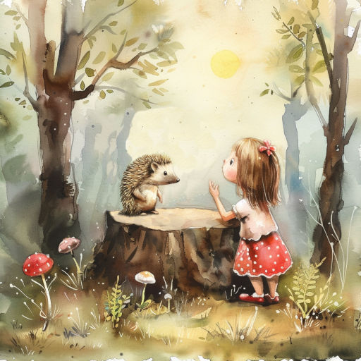

# Тайна

У меня, друзья, есть тайна.  
Никому не расскажу!  
Обо всём гадайте сами,  
Я доверюсь лишь ежу!

Эй, послушай, ёжик милый!  
Никому не говори,  
Как тебя бы не просили!  
В школе у Алёнки "три"...

Три чего -- не рассказала.  
Говорит: "Не приставай!"  
Три конфеты? Это мало!  
Торта три? Хоть отбавляй!

Что случилось, ёж-пузатик?  
Догадаться нелегко...  
Я хожу пока что в садик --  
Мне до школы далеко!

*01.02.2024 г., автору 12 лет*

***

*Это стихотворение награждено дипломом за победу в литературном конкурсе "Детство золотое", который проводило межрегиональное литературно-художественное объединение "Страна детства".*

*Также это произведение награждено дипломом за победу во Всероссийском конкурсе "Алый парус вдохновения", который проводило Челябинское отделение Союза писателей России.*

