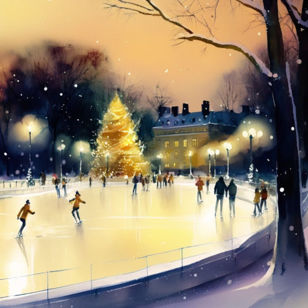

# На коньках

Парк окутал льдистый блеск,  
С неба звёздный сыплет снег.  
Под ногой морозный треск.  
Ветер ускоряет бег.

В жёлтом свете фонаря  
Фигурист скользит, летает.  
Арка, празднично горя,  
Вдаль аллею освещает.

Свищут тут и там коньки,  
А в глаза снежок метёт.  
И мерцают огоньки.  
Скоро будет Новый год!..

*09.12.2022 г.*

