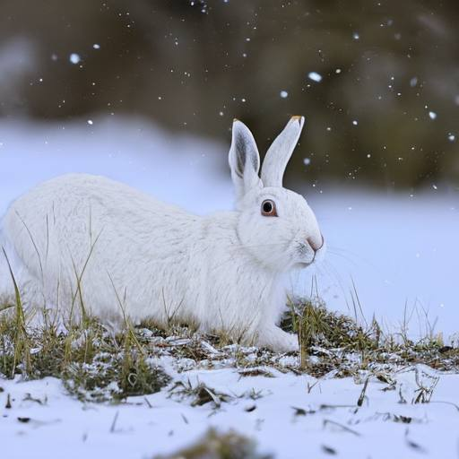

# Заяц

Шустрый заяц прыг да скок!  
От лисы удрать он смог.  
Шубка бурая спасла,  
Ель укрытие дала.

Это дело было летом.  
Но сейчас мы не об этом.  
Вновь зима здесь наступает,  
Шубку заинька меняет.

Был он бур, теперь он бел,  
Чисто бел, равно как мел.  
Может заинька не бегать,  
Ведь кругом так много снега!

В снег зайчишка залезает,  
Ушки плотно прижимает  
И сидит, и выжидает...

Ищет лис, и рыщет волк.  
Да какой же в этом толк?  
Заяц умный: в снег залез --  
И как будто бы исчез!

А весна как наступает,  
Снова шубку поменяет.  
Зайка серо-бурым станет,  
И опять врагов обманет!

Как-то так. Из года в год --  
Меховой круговорот!

*2022 г., автору 10 лет.*

