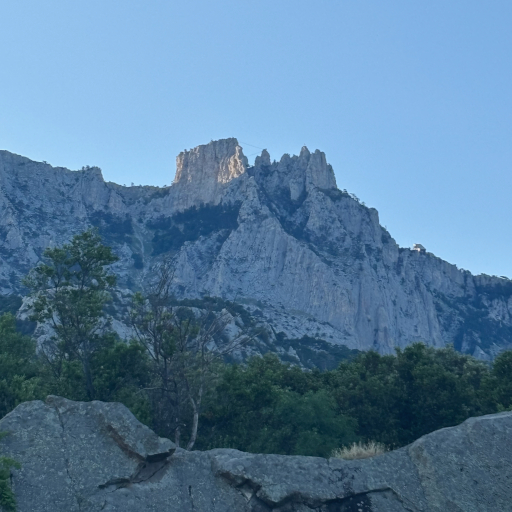

# Это лето

Надо мной -- гора Ай-Петри,  
Подо мной танцует море.  
Мир застыл, не слышно ветра,  
Голова полна историй.

Каждый камень, капля, ветка  
Будут помнить это лето.  
Вдохновенье ходит редко,  
Потому оно заметно.

*Лето 2025 года, автору 13 лет.*

