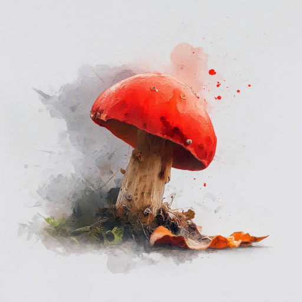

# Грибочек

Целый день кружу по лесу,  
Продираясь сквозь валежник.  
Где же ты, мой гриб чудесный?  
Не теряю я надежды.

Не уйду с пустой корзиной!  
Вот... Алеет впереди  
Гриб-малютка под осиной.  
Словно просит: "Пощади..."

Тяжело тебе, грибочек:  
Грибники найдут везде,  
Ёж грызёт и черви точат.  
Эх, расти!  
А тропка где?..

*14.09.2025 г., автору 14 лет*

