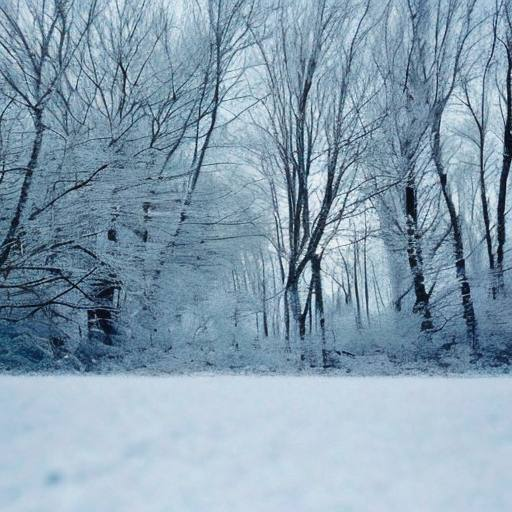

# Шаги зимы

Кружевом иней украсил траву,  
Лес оказался во сне наяву.  
Снежные хлопья засыпали мир.  
Кроны все мягкие, будто зефир.

Пруд задремал под укрытием льда,  
Вьюга закутала в снег города.  
Всюду позёмки струятся змеёй.  
Мир озарился Полярной звездой.

Ночь бесконечна... Но вот и заря.  
Бледный, холодный рассвет декабря.  
Ели темнеют сквозь призрачный тюль.  
Вроде недавно ещё был июль...

*2023 г., автору 12 лет.*

