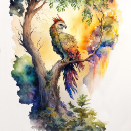
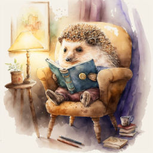

# Загадки

В этом разделе собраны мои загадки. Попробуйте найти отгадки самостоятельно. Чтобы проверить себя, нажмите на слово **Отгадка**, и вы увидите ответ.

- ## :material-chat-question-outline: Сам вода

    ---

    Сам вода водицей,  
    А кипятка боится...

    ??? info riddle "Отгадка"
        **Лёд**

- ## :material-chat-question-outline: Бабин "муж"

    ---

    Бабин "муж"  
    Родился среди стуж.  
    Сделан из водицы,  
    Вешнего солнца боится.

    ??? info riddle "Отгадка"
        **Снеговик**

- ## :material-chat-question-outline: По морю плывёт

    ---

    По морю плывёт,  
    На себе людей везёт.  
    Дым над ним столбом,  
    Порт его родимый дом.

    ??? info riddle "Отгадка"
        **Пароход**

- ## :material-chat-question-outline: В старых замках

    ---

    В старых замках обитает,  
    Ночью воет и летает,  
    Завывает и вздыхает.  
    А как утро наступает  
    Он мгновенно исчезает.

    ??? info riddle "Отгадка"
        **Призрак**

- ## :material-chat-question-outline: Пламя потушит

    ---

    Пламя потушит,  
    Воду осушит.  
    Бывает он бел,  
    Но это не мел.

    ??? info riddle "Отгадка"
        **Песок**

- ## :material-chat-question-outline: Может много

    ---

    Может много: исцелить,  
    Может в жизнь проблем прибавить,  
    Может судьбы изменить,  
    Чёрный след в душе оставить

    ??? info riddle "Отгадка"
        **Слово**

- ## :material-chat-question-outline: Пух мой чёрный

    ---

    Пух мой чёрный и чудесный.  
    Длинноног я и высок.  
    Несмотря на слух известный  
    Я не прячуся в песок.

    ??? info riddle "Отгадка"
        **Страус**

- ## :material-chat-question-outline: Среди своих

    ---

    Среди своих как королева.  
    Но конкуренток круг большой.  
    Хоть и нежна, но ранит смело,  
    Качнув короною цветной.

    ??? info riddle "Отгадка"
        **Роза**

- ## :material-chat-question-outline: Смирная лошадка

    ---

    Смирная лошадка  
    Гардероб везёт.  
    Вся семья опрятна  
    Будет целый год!

    ??? info riddle "Отгадка"
        **Напольная сушилка для белья**

- ## :material-chat-question-outline: Из стены торчит

    ---

    Из стены торчит,  
    Иногда ворчит.  
    Моет всю семью --  
    Вашу и мою.

    ??? info riddle "Отгадка"
        **Кран**

- ## :material-chat-question-outline: Защитит от солнца

    ---

    Защитит от солнца  
    И создаст уют.  
    Не смотри в оконце --  
    Стражник тут как тут!

    ??? info riddle "Отгадка"
        **Штора**

- ## :material-chat-question-outline: Шустрый, ловкий

    ---

    Шустрый, ловкий -- прыг да скок!  
    От лисы удрать он смог.  
    Шубка бурая спасла,  
    Ель укрытие дала.

    ??? info riddle "Отгадка"
        **Заяц**

***

*Загадки "Сам вода", "По морю плывёт", "Пламя потушит", "Среди своих", "Из стены торчит", "Защитит от солнца", "Пух мой чёрный" и "Может много" напечатаны в журнале "Золотой ключик" № 2 (758), 2024 (Липецк)*

***

*Загадки "Сам вода", "Бабин муж", "По морю плывёт" и "В старых замках" награждены грамотой за победу в конкурсе "Весёлый багаж".*

## Читайте также

<a href="../stories">
<figure>
<figcaption>Рассказы</figcaption>
</figure></a>

<a href="../tales">
<figure>
<figcaption>Сказки</figcaption>
</figure></a>

<a href="../poems">
<figure>
<figcaption>Стихи</figcaption>
</figure></a>

<a href="../fanfics">
<figure>
<figcaption>Фанфики</figcaption>
</figure></a>

<a href="../boulsport">
<figure>
<figcaption>Боулспорт</figcaption>
</figure></a>

<a href="../blog">
<figure>
<figcaption>Блог</figcaption>
</figure></a>

