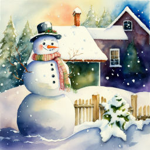
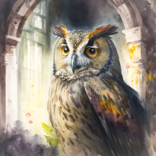

# Загадки

В этом разделе собраны мои загадки. Попробуйте найти отгадки самостоятельно. Чтобы проверить себя, нажмите на слово **Отгадка**, и вы увидите ответ.

## Сам вода

Сам вода водицей,  
А кипятка боится...

??? info "Отгадка"
    Лёд

## Бабин "муж"

Бабин "муж"  
Родился среди стуж.  
Сделан из водицы,  
Вешнего солнца боится.

??? info "Отгадка"
    Снеговик

## По морю плывет

По морю плывет,  
На себе людей везет.  
Дым над ним столбом,  
Порт его родимый дом.

??? info "Отгадка"
    Пароход

## В старых замках

В старых замках обитает,  
Ночью воет и летает,  
Завывает и вздыхает.  
А как утро наступает  
Он мгновенно исчезает.

??? info "Отгадка"
    Призрак

***

Эти загадки участвовали в конкурсе "Весёлый багаж".

***

## Читайте также

<a href="../stories">
<figure>
<figcaption>Рассказы</figcaption>
</figure></a>

<a href="../tales">
<figure>
<figcaption>Сказки</figcaption>
</figure></a>

<a href="../poems">
<figure>
<figcaption>Стихи</figcaption>
</figure></a>

<a href="../fanfics">
<figure>
<figcaption>Фанфики</figcaption>
</figure></a>

