# Ясная Поляна

Многие знают деревню Ясная Поляна, в которой расположена усадьба великого писателя Льва Николаевича Толстого. Любой турист, который сюда приедет, обязательно увидит башни въезда, Большой пруд, прешпект, дом писателя, флигель Кузьминских, посетит могилу Льва Толстого. На этом у большинства знакомство с Ясной Поляной и закончится. Но я хотела рассказать вам о немного другой Ясной Поляне, о тех местах, которые скрыты за основными достопримечательностями.

Если не входить во въездные ворота, а пройти по асфальтовой дороге до конца деревни, то вам откроются две тропы -- прямо и направо. Идя по правой тропе вы увидите маленький пруд с необитаемым островком, на котором растёт стройная берёза. Вода затянута сеткой ряски с тёмными прогалами, где плавают дикие утки.

Дойдёте до угла берёзовой рощи и увидите пруд побольше. Это Камзоловский пруд, на котором хорошо порыбачить. А по берегу пруда гуляют бычки, задумчиво пощипывая траву. Вы обогнёте рощу и пойдёте дальше, а по правую руку у вас будет овраг, склоны которого поросли высокой травой и мелкими кустами, а на дне едва слышно журчит речка Кочаки, маленькая и узенькая.

Берёзы сменятся смешанным лесом, а потом соснами. Если пройти дальше и повернуть налево, откроется сказочный вид на пруд, кажущийся таким далёким. Вокруг завьётся солнечный запах смолы и хвои. А если остановиться чуть раньше, то справа будет глинистая скользкая тропа, проходящая по дну оврага и круто поднимающаяся наверх. А там, за оврагом, вокруг раскинутся луга. Ветер будет гнать изумрудные волны травы, открывая притаившуюся полевую клубнику. Там цветут разноцветные люпины целыми полянами, изредка встречаются крохотные березняки, в которых по осени прячутся мухоморы, большие и маленькие.

Слева у вас окажется сияющая на солнце запруженная река Кочаки -- Кочаковский пруд, о котором нередко упоминал писатель в своих произведениях, письмах и дневниках.

Неподалёку есть тропа, ведущая в уютный лесок Ёлочки под Грумантом, над которым можно увидеть пролетающих аистов. Если пройти по ней дальше, вы попадёте в тихую лесную глубь. По весне там всё пестрит от первоцветов и разных растений, как всем известных (медуница, ветреница), так и редких, выходящих на поверхность раз в несколько лет -- таков ядовитый Петров крест, сиреневое или розоватое растение, похожее на щупальце подземного осьминога. "Там встречали мы ужей, видели в кустах ежей" -- эти строки из первого варианта моего [стихотворения "Зелёная палочка"](../poems/green-stick-legend.md), описывающие жителей тамошних мест. Кроме ужей и ежей, если повезёт, вы встретите косуль, настороженных и красивых животных. Вы увидите мелкие лесные пруды с дикими утками, поваленные изумрудные от мха деревья, ставшими мостами через многочисленные овраги. Если идти всё дальше и дальше, то вы вернётесь в усадьбу Льва Николаевича.

А если не идти в Ёлочки под Грумантом, а остаться на склоне холма, вы увидите плотину и водоотвод, служащий для того, чтобы Кочаковский пруд не выходил из берегов. Вода сливается по другую от пруда сторону плотины и пополняет реку Воронку. 
Можно так и путешествовать вдоль реки, идя по краю леса. Есть неприметная тропка, по которой вы сможете выйти через лес к могиле Льва Николаевича Толстого совершенно неожиданным путём. А можно всё идти вперёд, никуда не сворачивая. Река причудливо петляет, удивительно хитро оплетает островки суши и деревья. Удивляют и названия посадок, рощ, сменяющиеся одни за другими: Митрофановская посадка, Самородный лес, лес Осинник... Так можно дойти до водохранилища реки Воронки. Недалеко от начала водохранилища есть старый мост, который ведёт с северного берега Воронки на южный, к больнице имени Л.Н. Толстого.

Ясная Поляна -- не только Дом и прешпект. Это открытия, неожиданные встречи и долгие прогулки. Приезжайте сюда за яркими впечатлениями!

*02.06.2023 г., автору 11 лет.*

---

👇 Описанные маршруты в Яндекс.Картах:

* [Маршрут 1](https://yandex.ru/maps/?l=sat%2Cskl&ll=37.513736%2C54.068715&mode=routes&rtext=54.073154%2C37.529975~54.063489%2C37.519768~54.064338%2C37.509472~54.066319%2C37.501588~54.071353%2C37.494109~54.072212%2C37.496329~54.069900%2C37.509945~54.076367%2C37.521137~54.076127%2C37.526317~54.073162%2C37.530044&rtt=pd&ruri=~~~~~~~~ymapsbm1%3A%2F%2Forg%3Foid%3D157006990416~&z=14)
* [Маршрут 2](https://yandex.ru/maps/?l=sat%2Cskl&ll=37.514005%2C54.070632&mode=routes&rtext=54.073154%2C37.529975~54.063489%2C37.519768~54.064338%2C37.509472~54.066319%2C37.501588~54.071353%2C37.494109~54.077463%2C37.500378~54.075776%2C37.515453~54.076127%2C37.526317~54.073170%2C37.530025&rtt=pd&ruri=~~~~~~ymapsbm1%3A%2F%2Forg%3Foid%3D172702109120~ymapsbm1%3A%2F%2Forg%3Foid%3D157006990416~&z=14)
* [Маршрут 3](https://yandex.ru/maps/?l=sat%2Cskl&ll=37.518383%2C54.075917&mode=routes&rtext=54.073154%2C37.529975~54.063489%2C37.519768~54.064338%2C37.509472~54.066319%2C37.501588~54.071353%2C37.494109~54.077463%2C37.500378~54.087315%2C37.514337~54.090890%2C37.533067~54.081517%2C37.537070~54.073167%2C37.530080&rtt=pd&ruri=~~~~~~~~ymapsbm1%3A%2F%2Forg%3Foid%3D1055599970~&z=14)

---

Полистайте иллюстрации к очерку:

  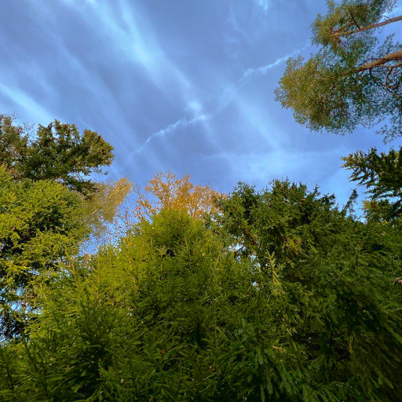
  
Лес

  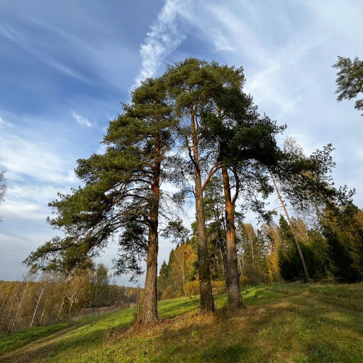
  
Три сосны

  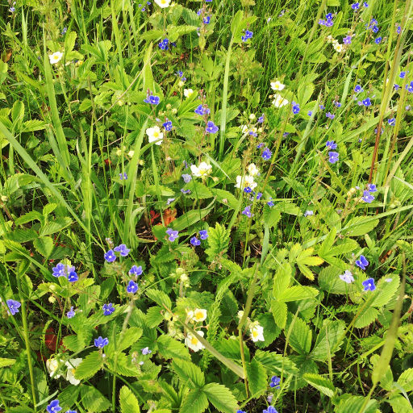
  
Цветущая полевая клубника

  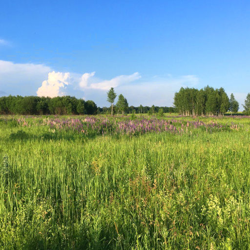
  
Поляны с люпинами

  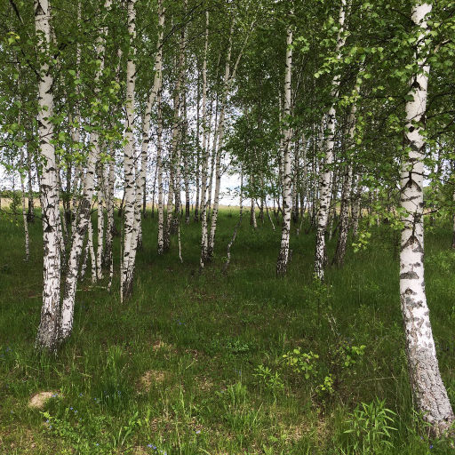
  
Березняки

  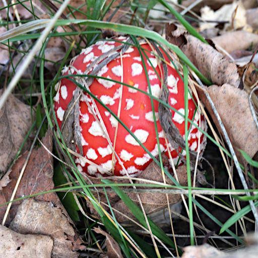
  
Мухоморы

  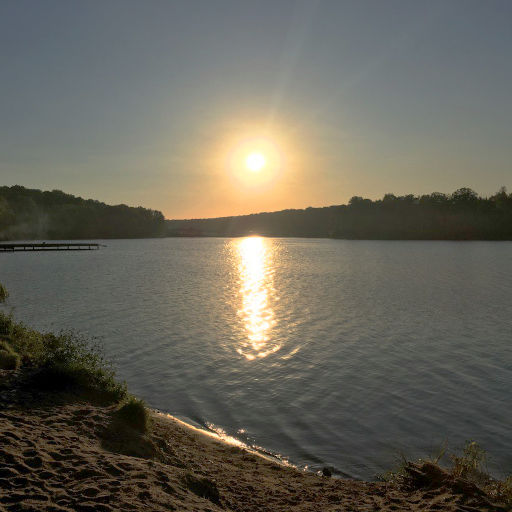
  
Кочаковский пруд

  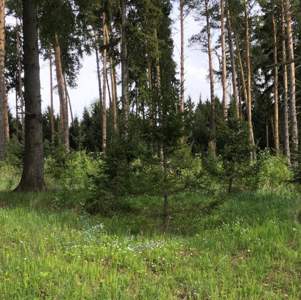
  
Ёлочки под Грумантом

  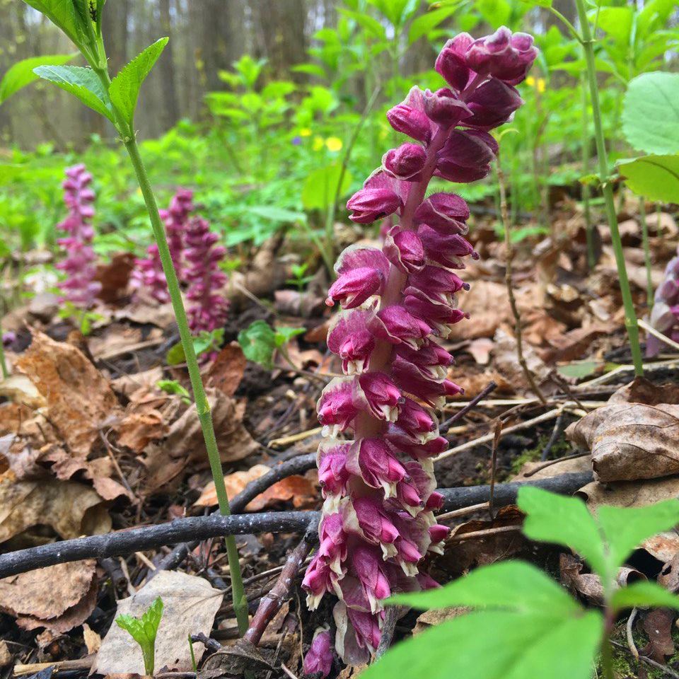
  
Петров крест

  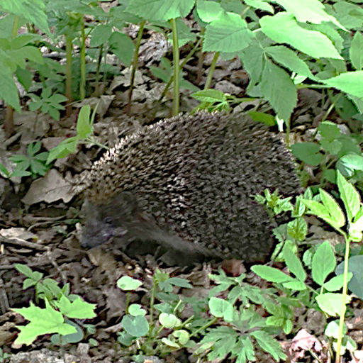
  
Ёж

  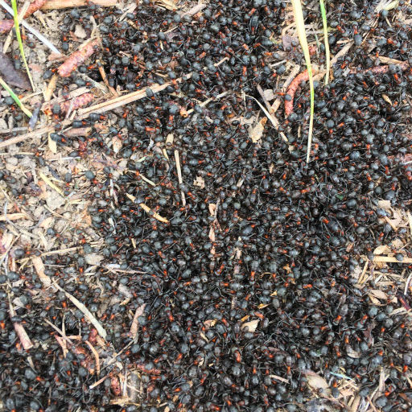
  
Муравьи

  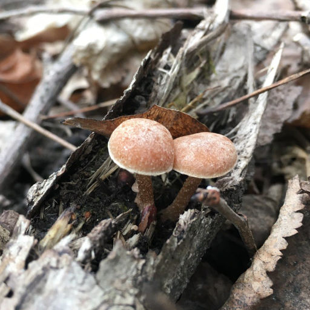
  
Грибы

  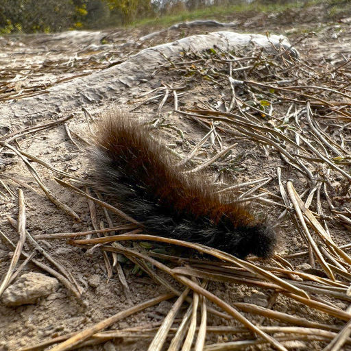
  
Гусеница

  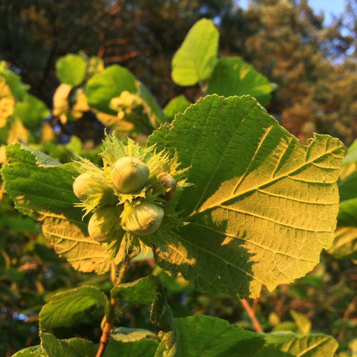
  
Орехи

  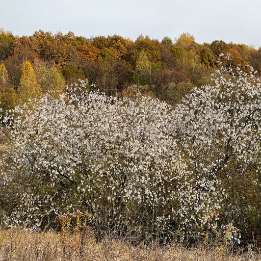
  
Осень в Ясной Поляне

<a class="prev" onclick="plusSlides(-1)">❮</a>
<a class="next" onclick="plusSlides(1)">❯</a>

 

  
  
  
  
  
  
  
  
  
  
  
  
  
  
  

