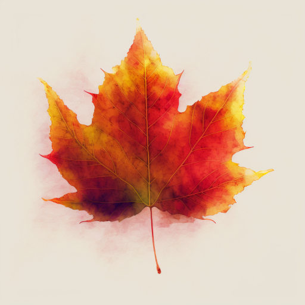

# Подарок осени

Гуляя по парку, я свернула на тропинку, ведущую в терем осени -- нарядный лес.

Стройные липы и ясени встречают меня шелестом ещё не опавшей листвы. Красавицы берёзы приветственно наклоняют свои ветви с золотыми косами листьев.

Ветер качнул ветви дуба и к моим ногам посыпались зрелые, коричневые жёлуди.

Ко мне подбежала пушистая белочка, уже начавшая менять свою шубку с рыжей летней на серую зимнюю. Она быстро схватила жёлудь и стрелой взлетела на дерево.

А вон на полянке кочка. Или это... ёжик?!

Когда я подошла ближе, ёж ощетинился иголками и укатился с поляны.

А вот на старом пне греется ящерица. А рядом с пнём кучка опят.

Жмётся к стволу осины подосиновик. Неподалёку от них около берёзы расположились подберёзовики, все с пятнистыми ножками.

По соседству с берёзой растёт рябина. На ней краснеют крупные кисти ягод. В суровую морозную зиму эти ягоды послужат кормом птицам. А сейчас это чудесное украшение осеннего леса.

Вдруг неожиданный порыв ветра закачал ветки деревьев и с них посыпались золотые, оранжевые, красные, багряные листья. Они летели к земле, медленно кружась. Какой прекрасный листопад!

Тут на мою ладонь упал небольшой кленовый листок. Какой красивый! Огненно-рыжий, края резные, веточка прямая, прожилочки красные. Когда я приду домой, то положу его в толстую книгу, засушу, и этот подарок осени будет храниться у меня долго-долго.

*2020 г.*

