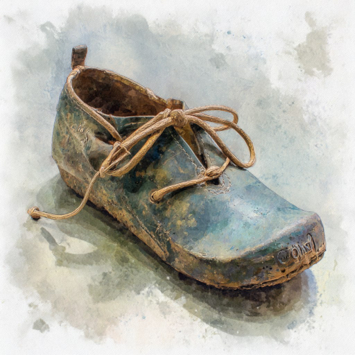

# Цвет Солнца

2 минуты
{ .md-time-to-read }

Когда-то у меня была пара. Мы шли одной дорогой, несмотря на ненастье, и были так похожи... Но нас разлучил мохнатый монстр Тедди. Он растерзал мою несчастную пару прямо у меня на виду...

Теперь я одна, никому не нужная, лежу в тёмном углу шкафа. С того ужасного дня моя жизнь топталась на месте.

Но недавно ко мне подселили пару болтливых Сандаликов. Новенькие, красивые, они блестели даже в полумраке. А ещё они постоянно между собой вздорили о мелочах и в этом совсем не походили на меня и мою утраченную пару. Но Сандалики были вместе. Сквозь приоткрытую дверцу шкафа я однажды видела, как Тедди бережно принёс их в зубах к ногам хозяйки. Почему так?

Сандалики без конца щебетали о лете и утверждали, что небо голубое. Я собиралась возразить... Хотя кто станет слушать Галошу? Наверно, я стала слишком старой, и память моя дырявая. Но всё, что я помню, это серость, мутные лужи и вечный дождь. 

А внутри меня всегда было тепло и сухо. И несмотря на то, что мой каблук сносился да и подошва частенько болела, я преданно берегла хозяина от сырости. Но какой прок от Галоши без пары?

А Сандалики болтали и болтали о своём: о мягкой траве, о лесных тропинках и тёплом песке. Они рассказывали о птичьих песнях, о бабочках, порхающих на лугах. Это так походило на выдумку... Но из всей этой болтовни я была готова вечно слушать об одном -- о Солнце.

Сандалики говорили, что Солнце круглое и большое, как велосипедное колесо. А ещё оно горячее, как батарея. И в его лучах мир играет яркими красками.

-- А какого оно цвета? -- осторожно спросила я хриплым от вечной простуды голосом.

-- Ой, оно то жёлтое, то почти белое, то оранжевое и даже красное... -- перебивая друг друга ответили Сандалики, не умевшие толково объяснять.

Наверно мне, одинокой Галоше, не понять эту легкомысленную пару. И в тёмном шкафу, когда Сандалики уходили и становилось тихо, я пыталась представить... И мне мерещилось тепло, и я видела свет, который никогда не знала...

Но однажды дверцы шкафа широко распахнули. Хозяин, держа груду разных вещей, взял меня. Неужели обо мне вспомнили?

На руках у хозяина я покинула дом, и внутри меня всё затрепетало. Посреди двора полыхал яркий свет. Всё, что я помнила блёклым, обрело цвет. Неужели это оно?..

Хозяин отпустил меня. Весь мир превратился в свет, о котором я мечтала в своём шкафу. Мне было горячо, но не больно. Я плакала, а вокруг меня вздымались алые волны, распускались рыжие цветы, падали золотые звёзды...

Вот ты какой, цвет Солнца.

*17.02.2026 г., автору 14 лет.*

